# DCC 文控系统需求说明书（第一版）

| 项目 | 说明 |
|---|---|
| 文档版本 | V1.5.19 |
| 编写日期 | 2026-07-21 |
| 最近修订 | 2026-07-27（V1.5.19：预览/下载改为「原格式前端预览 + 原格式强制水印下载」；三级表单可编辑 Word/Excel/PPT；与原型 `web/` 对齐） |
| 所属公司 | 米格实验室（霸州需求） |
| 建设方式 | **方案 A**：嵌入米格实验室现有后台，独立业务域 `dcc` |
| 版本号规则 | **正式版**：`1.0` / `2.0`（审批升版）；**三级表单轻量修订**：`r1` / `r2`（免审批，与正式版号分离，见 §4.2 / §19.1） |
| 审批引擎 | **DCC 内置简易审批**（不依赖现有 BPM；流程模板可配置；**强制记录电子签名、时间戳、岗位权限**） |
| 预览方式 | **首期：原格式在线预览**（PDF / 图片 / Word / Excel / PPT 前端解析嵌套预览；**不强制**先转 PDF）。正式环境若 IT 提供统一转 PDF 服务，可作为增强项叠加（见对接清单） |
| 纸质受控 | **首期必须做**：纸质受控份登记、换版、回收 |
| 打印 / 水印 | **打印功能必做**；**下载 / 打印强制水印**（不可关）；**预览加水印可由文控开关**（其他部门不可改） |
| 培训联动 | **文件生效自动触发相关岗位培训任务**，跟踪完成并出具培训证明 |
| 合规导出 | **一键导出**：按时间点打包文件版本 + **文件正文** + 审批记录 + 分发台账 + **分发签收台账** + 培训证明（Excel 多工作表） |
| 关联性 | 与 HR/ERP 无强耦合；复用现有账号、组织、部门、角色、文件存储、站内信；培训任务可内置，亦可对接现有培训模块（若有） |

---

## 1. 背景与目标

### 1.1 背景

公司所有受控文件需在 DCC 文控系统进行全生命周期管理。现状：公司尚无文控系统，与其他业务模块无关联，需从零设计。

### 1.2 建设目标

1. 统一受控文件台账，杜绝多版本并存、过期文件继续使用。
2. 新建 / 修订 / 作废线上逐级审批，过程可追溯；审批节点强制留存**电子签名、操作时间戳、审批人岗位与权限快照**。
3. 变更通知、新旧版本替换与纸质回收闭环；修订/作废**必须填写变更（作废）原因**。
4. 电子分发签收 + 纸质受控份管理；**受控打印**（强制水印 + 受控号）。
5. 借阅（跨部门临时预览）、外发（令牌外链+专用水印包）、外来文件登记（须附件）受控管理。
6. 待办、复审到期、文件更新提醒；文件生效后**自动触发岗位培训任务**并追踪完成。
7. **震慑 + 溯源**（非「防住泄密」）：下载 / **打印强制水印可溯源**；预览水印默认开、**可由文控关闭**；常态只读，打印/下载等敏感操作**二次申请留痕**。纯 Web 无法硬拦截截图/拍照/OS 打印，验收不以「防住泄密」为通过条件（权威规则见 §10）。
8. 检索可达：全文检索 + 文件编号 / **文件级别**等精准筛选；**可判定验收**为检索 P95 < 2s；「约 10 秒定位」为体验目标（非硬性通过/不通过，见 §12 / §14）。
9. 合规一键导出：按任意时间点打包**文件版本、文件正文、审批记录、分发台账、分发签收台账、培训证明**；一键导入可提交正文。
10. 台账查询：文件、变更、领用/分发、借阅、下载/打印日志。

### 1.3 非目标（首期不做）

- 不对接完整 QMS（如 CAPA、不合格品全流程；**岗位培训任务与证明属于首期必做，见 §8.16**）。
- 不做工程 ECR/ECN 研发变更全套。
- 不做 OnlyOffice 在线协同编辑。
- 不做专业 DRM 加密客户端；**亦不承诺**可硬拦截浏览器/OS 级绕过打印或截屏（定位为震慑 + 溯源，见 §5.4 / §10）。
- ~~不做全文检索~~（**V1.1 起全文检索纳入首期**，见 §8.19；实现可采用 DB 全文 / 轻量搜索服务，不强制 Elasticsearch）。

### 1.4 用户角色（建议）

| 角色编码 | 角色名称 | 说明 |
|---|---|---|
| DCC_ADMIN | 文控管理员 | 配置分类/编号/流程/水印；全库管理；强制回收；一键合规导出 |
| DCC_CONTROLLER | 文控员 | 编号确认、发布、分发、纸质受控、打印登记、台账维护 |
| DCC_AUTHOR | 编制人 | 起草、修订、提交申请（含变更原因） |
| DCC_DEPT_LEADER | 部门负责人 | 部门内审批（签名+岗位留痕） |
| DCC_QA | 质量负责人 | **首期不启用**：公司暂无独立质量批准模块；审批不强制质量批准 |
| DCC_EMPLOYEE | 普通员工 | 查看已分发现行文件、签收、借阅/培训任务；敏感操作二次申请 |
| DCC_AUDITOR | 审计只读 | 全库只读 + 合规包导出；默认无下载原文（可配置） |

> 角色挂接现有系统「角色管理」，通过菜单权限 + 按钮权限 + 数据权限控制。  
> **已取消**独立「生产一线 / 研发核心」角色；业务上按**部门员工 / 部门负责人 / 文控**授权。文件主档仍可标注数据域 `PROD`/`RD`/`ALL`（筛选与台账用），**不再**作为独立角色互斥可见域。

### 1.5 界面与字段约定（V1.2）

| 约定 | 说明 |
|---|---|
| 密级选项 | 首期仅 **内部 / 机密** 两档；字段枚举 `INTERNAL` / `SECRET`（`PUBLIC` 仅预留扩展位，首期业务与 UI **不启用**） |
| 机密标识 | 列表与详情中，文件名称后展示红色 **「密」** 字标（security=SECRET） |
| 数据域选项 | 业务文件取值 **`PROD`（生产）/ `RD`（研发）**；`ALL` 表示**跨域共用文件**（如公司级程序文件），文控/审计角色另有全域可见能力，与 `ALL` 取值无关 |
| 列表字段顺序 | 与文件相关的列表：**文件ID** → 文件编号 → 文件名称（含密标）→ **文件级别** → **业务领域** → …；状态类字段后、操作前再放版本/日期/责任人等明细 |
| 列表列宽（建议） | **文件ID**列约 **68px**；**操作**列宜偏窄、按钮居中；**文件级别**列约 **150px**；**业务领域 / 所属部门**因支持多值，建议 **min-width ≥ 160px** |
| 文件ID | 主档唯一编码：纯数字流水号，系统自动生成（DB 自增主键即可）；与受控编号 `doc_no` 正交；界面展示为「文件ID」。**勿**与版本附件存储字段 `file_id`（对象存储 ID）混淆 |
| 台账 vs 综合查询 | **受控文件台账**：**全员可查**（待生效仅文控）；日常办理；台账侧预览/下载/打印遵循本部门非密。**综合查询**：只读检索（详情/预览/导出）。**我的受控文件**：仅已签收份，操作权限更完整（见 §5.3） |
| 审批终审 | **不强制质量批准**；默认终审节点为文控审核（见 §6.3）；审批模板可配置节点顺序，但首期模板不含质量批准 |
| 外来文件 | 仅文控/部门负责人可登记（标准/客户），**须上传附件**，登记后出现在外来文件台账 |
| 培训证明 | 文件生效联动培训；完成/下载证明须含水印（多条斜向水印） |
| 合规导出 / 导入 | 工作台提供；**一律 Excel（.xlsx）**；导入须先下载模板（含**正文**列与「文件正文」表）；导出多工作表：版本清单 / **文件正文** / 审批记录 / 分发台账 / **分发签收台账** / 培训；**范围按文件级别**（全库 / 一 / 二 / 三级） |
| 列表导出 | 台账、审计日志等业务列表导出**必须为 Excel**，不以 CSV/TXT 作为正式导出格式 |
| 文件级别 | 独立字段 `file_level`：`L1` 一级（宏观）/ `L2` 二级（部门细则）/ `L3` 三级（表单）；一二级网页不可改正文；三级可网页编辑（Word/Excel/PPT 正文轻量编辑；PDF 叠字段填写）、**免审批**，每次保存递增**轻量修订号 rN**（见 §4.2 / §19.1） |
| 业务领域 | **支持多选**（至少 1 个）；与文件级别正交；界面展示为中文名，**英文逗号 `,` 分隔**（例：`半导体检测,硅光芯片量产`）；存储见 §8.2.3 / §19.1a |
| 所属部门 | **支持多选**（至少 1 个）；首期字典含行政部/市场部/技术部/IT部/财务部；展示同样用英文逗号分隔；**台账侧**：用户部门命中**任一**所属部门且非机密时，可直预览/直下/直打；**已签收「我的受控文件」**：不受本部门非密限制，可完整预览/下载/打印（含机密） |
| 基础配置维护 | **仅文控**（`DCC_CONTROLLER` / `DCC_ADMIN`）可**新增/修改**：文件分类、业务领域、文件所属部门、水印策略（含预览是否加水印、模板、透明度）；其他部门**一律只读**，无改配资格 |
| 阶段状态水印 | 在平铺水印之上叠加**红色阶段水印**（见 §7.3 / §19.7）；机密另加正中斜对角「机密文件」；预览层随「预览加水印」开关一并显隐 |
| 角色工作台 | 「我的受控文件 / 待办 / 培训 / 近 7 日生效 / 统计角标」按当前角色过滤（见 §8.1） |


---

## 2. 总体架构（方案 A）

```
现有前端（Vue 3.5 + TypeScript 5.3 + Element Plus + Vite）
  └─ 新增一级菜单：DCC文控系统（路由/菜单挂现网 Layout，不自带独立壳）
         │
现有网关 / 登录鉴权 / 租户 / 组织用户 / 角色权限
         │
┌────────┴────────┐
│  现有文件服务     │  ← 对象存储（附件原文，业务表只存 fileId）
│  现有站内信/消息  │  ← 待办与提醒
└────────┬────────┘
         │
┌────────▼────────────────────────────────────────┐
│  新模块 dcc-server（Spring Boot 业务包）           │
│  · 文件主档 / 版本 / 变更 / 分发 / 签收            │
│  · 纸质受控 / 借阅 / 外发 / 外来 / 复审            │
│  · 内置简易审批 / 水印策略 / 合规导出 / 审计日志   │
└─────────────────────────────────────────────────┘
         │
   MySQL（表前缀 dcc_） + Redis（缓存/待办计数/编号序列等，按需）
```

**技术约定（对齐米格现网，V1.5.4 固化）**

| 项 | 选型 |
|---|---|
| 前端 | **Vue 3.5 + TypeScript 5.3 + Element Plus + Vite + Vue Router**（与现网/若依一致；模块目录 `views/dcc`、`router/modules/dcc.js`，后续补 `api/dcc`） |
| 后端 | **JDK 17 + Spring Boot 3.4 + MyBatis Plus**（独立业务包 / 模块 `dcc`） |
| DB | **MySQL**，表前缀 `dcc_`；若现网多租户则带 `tenant_id` |
| 缓存 | **Redis**（会话/权限随现网；DCC 侧可用于待办角标、编号发号、短时缓存等） |
| 文件 | 复用现有文件中心；业务表只存 `fileId` |
| 预览 | **原格式前端预览**（PDF 内嵌；图片直显；Word/Excel/PPT 前端解析）；可选叠加服务端转 PDF（正式环境增强，非首期硬依赖） |
| 下载水印 | **原格式强制水印**：PDF / docx / xlsx / pptx / 图片写入水印后再下发；**不**默认把 Office 一律转成 PDF 才下载 |
| 审批 | DCC **内置简易审批**（不接现网 BPM）；流程模板 + 节点 + 待办 + 通过/驳回；强制电子签名/时间戳/岗位快照 |
| 消息 | 站内信为主；预留企微/邮件开关 |
| 可点测前端 | 仓库 `web/`：Vite Vue 工程 + Vue Router + Mock；页面按菜单分组于 `views/dcc/*`；路由配置独立为 `router/modules/dcc.js` 供公司主路由导入；**正式上线须去掉原型壳，挂入现网/若依 Layout** |

---

## 3. 信息架构与菜单

```
DCC文控系统
├─ DCC工作台
├─ 文件库
│  ├─ 受控文件台账（全文搜索 + 编号/文件级别/业务领域精准筛选）
│  ├─ 我的受控文件
│  └─ 版本历史（从文件详情进入）
├─ 申请与审批
│  ├─ 申请（页内：新建 / 修订 / 作废入口 + 我的申请列表）
│  └─ 待我审批（签名时间戳可见；≠ 复审任务）
├─ 变更管理
│  ├─ 变更单
│  └─ 变更通知
├─ 分发与签收
│  ├─ 分发单
│  ├─ 待我签收
│  └─ 纸质受控份 / 受控打印
├─ 借阅与外发
│  ├─ 借阅申请
│  ├─ 外发申请
│  └─ 打印/下载二次申请
├─ 培训任务（生效联动）
│  ├─ 我的培训待办
│  └─ 岗位培训矩阵
├─ 外来与复审
│  ├─ 外来文件
│  └─ 复审任务（到期复审：维持 / 发起修订 / 作废；≠ 待我审批）
├─ 台账查询
│  ├─ 综合查询
│  └─ 记录（变更 / 分发领用 / 借阅外发 / 下载预览打印日志，页内切换类型）
├─ DCC 工作台内嵌：一键合规导入（上）/ 一键合规导出（下）（Excel；有权限时展示）
└─ 基础配置（单菜单页，页内选择配置类型）
   ├─ 文件分类
   ├─ 业务领域
   ├─ 文件所属部门
   ├─ 编号规则
   ├─ 审批流程模板
   └─ 水印策略（下载/打印强制；预览可由文控开关）
```
> 基础配置中「业务领域 / 文件所属部门 / 水印策略 / 文件分类」的**增改仅文控**；其他角色可进页查看，按钮禁用。

---

## 4. 领域模型与状态机

### 4.1 核心对象

| 对象 | 说明 |
|---|---|
| 文件主档 Document | 一份受控文件的身份（编号、标题、分类），不随小改动消失 |
| 文件版本 DocumentVersion | 主档下的具体版本（1.0、2.0…），含正文附件与生效信息 |
| 申请单 Apply | 新建/修订/作废三类申请 |
| 审批实例 ApprovalInstance | 内置审批运行实例 |
| 变更单 ChangeOrder | 修订发布后的变更闭环（含回收） |
| 分发单 Distribution | 电子分发任务 |
| 签收记录 Receipt | 员工已读/签收 |
| 纸质受控份 HardCopy | 打印纸质受控份台账 |
| 借阅单 Borrow | 内部借阅 |
| 外发单 ExternalRelease | 对外发文 |
| 外来文件 ExternalDoc | 客户文件/标准文件 |
| 复审任务 ReviewTask | 到期复审 |

### 4.2 版本号规则（双轨：正式版 + 三级轻量修订）

#### 4.2.1 正式版本（审批升版，适用于全部文件级别）

| 场景 | 规则 |
|---|---|
| 首次发布 | 正式版本号 = `1.0` |
| 修订发布（走审批） | 主版本 +1 → `2.0`、`3.0`…（首期不做 1.1 小版本） |
| 草稿 | 显示为「目标版本-draft」，如 `2.0-draft`，不进入现行库 |
| 作废 | 版本状态变为「已废止」，主档状态「已废止」 |
| 唯一性 | 同一主档下正式 `version_no` 唯一 |

> 配置项预留：是否允许 `x.y` 小版本（二期）。首期固定「每次**正式审批发布**主版本+1」。

#### 4.2.2 三级表单轻量修订号（V1.5.6 定稿 · 评审 T-02 方案 A）

| 项 | 规则 |
|---|---|
| 适用 | 仅 **三级（L3）表单** 网页直接改正文、**免审批** 保存 |
| 可编辑格式（首期） | **Word（.docx）** 正文轻量编辑（保留图片）；**Excel（.xlsx）** 单元格编辑；**PPT（.pptx）** 按页改文本（保留原图/版式）；**PDF** 叠字段填写并写回末页。旧版 `.doc` / `.xls` 建议先转为 OOXML |
| 标识 | 轻量修订号 `revision_no`，形如 `r1`、`r2`、`r3`…（或等价序列）；**不得**写成 `2.0`、`3.0` |
| 与正式版关系 | 台账「现行版本」仍展示绑定的正式版（如 `1.0`）；详情/预览同时展示「轻量修订 rN」 |
| 历史 | 每次免审批保存写入 `dcc_form_revision`（或版本扩展表）一条快照：修订号、保存人、服务器时间戳、变更摘要（可选）、正文 fileId |
| 谁可改 | 文件责任人、所属部门有编辑权限者、文控员/文控管理员（按钮权限控制）；操作留痕可查 |
| 正式升版 | 需要对外宣称「受控升版」时仍走 **修订申请审批**，正式版号 +1；升版生效后可将当前 rN 内容固化为该正式版正文，轻量序列可重置或继续累计（配置项，首期建议重置为 r1） |
| 禁止 | 免审批保存**不得**占用/推进正式 `1.0/2.0` 主版本号，避免与审批升版语义混淆 |

> **合规口径**：三级表单日常改动为「受控表单内容维护（轻量修订 + 全留痕）」；外审关注的正式受控升版仍以审批发布的 `1.0/2.0` 为准。

### 4.3 文件主档状态

| 状态 | 编码 | 说明 |
|---|---|---|
| 起草中 | DRAFTING | 有未发布草稿申请 |
| 现行有效 | EFFECTIVE | 存在现行版本 |
| 修订中 | REVISING | 现行有效且存在进行中的修订申请 |
| 已废止 | OBSOLETE | 全部版本不可作为现行使用 |
| 已归档 | ARCHIVED | 长期归档，仅审计可查 |

### 4.4 文件版本状态

| 状态 | 编码 | 说明 |
|---|---|---|
| 草稿 | DRAFT | 未提交或审批中附属草稿 |
| 审批中 | IN_APPROVAL | 随申请单审批 |
| 已批准待生效 | APPROVED_PENDING | 已批未到生效日 |
| 现行有效 | EFFECTIVE | 唯一现行（同一主档同时最多 1 个） |
| 已替代 | SUPERSEDED | 被新版替代 |
| 已废止 | OBSOLETE | 作废流程完成 |
| 归档 | ARCHIVED | 归档只读 |

### 4.5 版本生命周期

```
草稿 --提交--> 审批中 --通过--> 已批准待生效 --到达生效日--> 现行有效
                |驳回
                v
              草稿
现行有效 --新版生效--> 已替代
现行有效 --作废通过--> 已废止
```

**硬规则**

1. 同一主档同一时刻只能有一个「现行有效」版本。
2. **生效前置条件**：版本进入「现行有效」前，`effective_date`（确切生效日期）**必须已填写且合法**；缺失则禁止从「已批准待生效」流转为「现行有效」（系统阻断并告警文控）。
3. 新版到达生效日并经定时任务成功处理后：旧现行版自动变「已替代」，并写入 `obsolete_date = 新版 effective_date`（旧版不可再按现行打开）。「瞬间」语义见下方定时任务边界。
4. 新版生效同步触发：变更通知 + 纸质回收任务 + **相关岗位培训任务**（见 §8.16）。
5. **分发权限两段式**（文控/审计除外）：  
   - **分发发送后**：被分发对象获得该版本**预览权**（用于完成「预览满 N 秒再签收」）；  
   - **签收完成后**：获得该版本**持续查看权**，并进入「我的受控文件」；对该文件预览/下载/打印**不受「本部门非密」限制**（含机密，仍强制水印）；未签收前仅可在「待我签收」处理。  
6. **分发发送范围**：**文控**仅可向各部门**负责人**分发现行有效文件；**部门负责人**仅可向**本部门员工**二次分发；普通员工不可分发。仅**现行有效**可分发（待生效不可分发）。  
7. **待生效可见性**：状态为「已批准待生效」的版本/主档，**仅文控**在受控文件台账可见；非文控不可见、不可操作。  
8. 常态打开正文均为**只读预览**（打印/下载另按 §5.3）。

#### 4.5.1 到达生效日 · 定时任务边界（V1.5.7 / T-06）

| 项 | 约定 |
|---|---|
| 生效判定时点 | 以服务器时区为准：当 `effective_date` ≤ **当日日历日**（含等于当天）即视为「已到达生效日」；建议按「生效日 00:00 起可被扫描命中」理解，**非**毫秒级真瞬间 |
| 扫描周期 | 首期建议 **每小时** 至少 1 次；允许配置为每日固定时刻，但须在验收环境声明实际周期 |
| 扫描粒度影响 | 生效日当天、任务尚未跑完前，旧版可能仍短暂可按现行打开；任务成功后必须以新版为准，旧版立即 SUPERSEDED |
| 失败重试 | 任务失败写告警（文控可见）+ 自动重试（建议指数退避，上限可配）；不得静默跳过 |
| 幂等 | 同一 `version_id` 的「生效 / 旧版替代 / 自动分发 / 培训任务生成」必须幂等：重复执行不得产生重复分发单、重复培训任务或重复通知 |
| 补偿 | 提供文控侧「手动触发生效扫描」或按版本「补偿生效」能力，用于任务长时间失败后的人工修复 |

---

## 5. 权限模型

### 5.1 权限点（按钮级）

| 权限码 | 含义 |
|---|---|
| dcc:doc:query | 查看台账/详情元数据 |
| dcc:doc:preview | 在线预览（常态只读） |
| dcc:doc:download | 下载（默认需二次申请或角色直授） |
| dcc:doc:print | 受控打印（强制水印；默认需二次申请或角色直授） |
| dcc:doc:create | 发起新建 |
| dcc:doc:revise | 发起修订 |
| dcc:doc:obsolete | 发起作废 |
| dcc:approve | 审批 |
| dcc:distribute | 发起/管理分发 |
| dcc:receipt | 签收 |
| dcc:borrow | 借阅申请 |
| dcc:external | 外发申请 |
| dcc:access:apply | 发起打印/下载二次申请 |
| dcc:hardcopy | 纸质受控管理 |
| dcc:training | 培训任务处理/证明查看 |
| dcc:config | 基础配置 |
| dcc:audit:export | 一键合规导出 / 审计包 |

### 5.2 数据权限

| 范围 | 规则 |
|---|---|
| 本人 | 我创建的申请、分发给我的文件、我的培训待办 |
| 本部门 | 部门负责人看本部门编制/分发；部门员工近 7 日生效等按所属部门收窄 |
| 全公司 | 文控员、文控管理员、审计 |

### 5.3 访问控制与二次申请（首期强制）

| 场景 | 规则 |
|---|---|
| 受控文件台账可见 | **全员可查**现行等相关文件（套数据域过滤）；**待生效仅文控**可见 |
| 台账侧预览/下载/打印 | 非文控：仅**本部门非密**可直接操作（一/二/三级相同）；跨部门或机密须二次申请（预览不可越权） |
| 我的受控文件（已签收） | 对该文件预览/下载/打印**完整权限**，**不**再套用「本部门非密」限制（含机密；仍强制水印；`allowDownload=false` 等文件级禁止仍生效） |
| 常态访问 | 默认**只读预览**（含水印，预览水印可由文控开关） |
| 打印 | 无直授且不满足「台账本部门非密 / 已签收全权限」时，须「打印二次申请」→ 审批通过后方可受控打印；全程留痕 |
| 下载 | 无直授且不满足上款时，须「下载二次申请」→ 审批通过后下载**含水印文件**（保持原格式：PDF/Office/图片）；全程留痕 |
| 角色差异 | 文控可全局直授打印/下载；部门负责人处理二次申请初审；丢失确认等特殊操作仅文控 |
| 留痕 | 申请单号、申请人、文件版本、用途、审批结果、操作时间、IP 写入 `dcc_access_log` / `dcc_access_apply` |

表：`dcc_access_apply`（打印/下载二次申请）

| 字段 | 类型 | 必填 | 说明 |
|---|---|---|---|
| id | bigint | Y | |
| apply_no | varchar(64) | Y | |
| action_type | varchar(16) | Y | PRINT / DOWNLOAD |
| document_id / version_id | bigint | Y | |
| reason | varchar(1000) | Y | 用途说明 |
| status | varchar(32) | Y | DRAFT / IN_APPROVAL / APPROVED / REJECTED / USED / EXPIRED |
| applicant_id | bigint | Y | |
| approved_at | datetime | N | |
| expire_at | datetime | N | 批准后有效期（建议 24h～7d 可配） |
| used_at | datetime | N | 实际打印/下载时间 |

### 5.4 下载 / 打印与溯源策略（首期）

> **定位（T-04）**：震慑 + 可溯源，**不是**防住泄密。全局强制规则以 **§10** 为准；本节为落地说明。

| 策略 | 规则 |
|---|---|
| 预览水印 | **默认开启**；可由文控在全局水印策略中开关（`apply_preview`）；开启时：`姓名+工号+文件编号+时间` 平铺 + **红色阶段水印**；Office 预览页亦须叠加；关闭时预览不叠加水印层 |
| 下载水印 | **强制**：输出**已加水印的原格式文件**（PDF 逐页；Word/Excel/PPT 嵌入可见水印；图片整图水印）；**不得**下发未加水印原件；文控不可关闭。受控打印场景仍可额外输出含水印 + `copy_no` 的 PDF |
| 红色阶段水印 | 下载/预览在平铺水印之上叠加（如「审批完成」「已分发」「借阅」「失效」等，见 §7.3）；Excel/Word 下载须可见红章 |
| 受控打印 | **强制**：须走受控打印输出含水印 + `copy_no` 的 PDF；预览页**引导**用户走受控打印，并尽量禁用页内「无水印直接打印」入口；文控不可关闭 |
| 绕过说明 | 截图、拍照、操作系统打印、浏览器插件等**无法硬拦截**；绕过后仍依赖水印/审计做事后溯源。验收不得要求「防住绕过」 |
| 禁止下载 | 文件或分类可配置 `allowDownload=false`，仅预览；即使二次申请也拒绝 |
| 下载次数 | 可选：单用户每日上限（配置） |
| 外发包 | 必须水印 + 有效期；到期链接失效（令牌安全见 §8.10） |

---

## 6. DCC 内置简易审批设计

### 6.1 流程模板

表：`dcc_approval_template`

| 字段 | 类型 | 必填 | 说明 |
|---|---|---|---|
| id | bigint | Y | 主键 |
| template_code | varchar(64) | Y | 唯一编码，如 DOC_CREATE |
| template_name | varchar(100) | Y | 名称 |
| biz_type | varchar(32) | Y | CREATE / REVISE / OBSOLETE / BORROW / EXTERNAL / HARDCOPY_PRINT / ACCESS_PRINT / ACCESS_DOWNLOAD |
| enabled | tinyint | Y | 是否启用 |
| remark | varchar(500) | N | 备注 |

表：`dcc_approval_template_node`

| 字段 | 类型 | 必填 | 说明 |
|---|---|---|---|
| id | bigint | Y | 主键 |
| template_id | bigint | Y | 模板 ID |
| node_order | int | Y | 顺序，从 1 开始 |
| node_name | varchar(64) | Y | 节点名称 |
| approver_type | varchar(32) | Y | ROLE / DEPT_LEADER / USER / DCC_CONTROLLER |
| approver_value | varchar(64) | N | 角色编码或用户 ID；DEPT_LEADER 可空 |
| approve_mode | varchar(16) | Y | ANY（或签）/ ALL（会签），首期默认 ANY |
| remark | varchar(200) | N | |

### 6.2 审批实例

表：`dcc_approval_instance`

| 字段 | 类型 | 必填 | 说明 |
|---|---|---|---|
| id | bigint | Y | |
| biz_type | varchar(32) | Y | |
| biz_id | bigint | Y | 申请单 ID |
| template_id | bigint | Y | |
| status | varchar(32) | Y | RUNNING / APPROVED / REJECTED / CANCELLED |
| current_node_order | int | Y | 当前节点 |
| applicant_id | bigint | Y | 申请人 |
| submitted_at | datetime | Y | |
| finished_at | datetime | N | |

表：`dcc_approval_task`

| 字段 | 类型 | 必填 | 说明 |
|---|---|---|---|
| id | bigint | Y | |
| instance_id | bigint | Y | |
| node_order | int | Y | |
| node_name | varchar(64) | Y | |
| assignee_id | bigint | Y | 审批人 |
| status | varchar(32) | Y | PENDING / APPROVED / REJECTED / SKIPPED |
| comment | varchar(1000) | N | 意见 |
| operated_at | datetime | N | **操作时间戳**（服务器时间，精确到秒） |
| e_signature | varchar(500) | N | **电子签名**：手写板 Base64 / 签名图片 fileId / 或「姓名+工号」确认签名字符串 |
| signature_type | varchar(32) | N | HANDWRITE / IMAGE / CONFIRM_TEXT |
| signer_user_no | varchar(64) | N | 签名时工号快照 |
| signer_dept_name | varchar(100) | N | 签名时部门快照 |
| signer_post_name | varchar(100) | N | **岗位名称快照**（来自组织/HR 岗位） |
| signer_role_codes | varchar(500) | N | **当时拥有的 DCC 角色/权限码快照**（如 DCC_DEPT_LEADER,dcc:approve） |
| client_ip | varchar(64) | N | 操作 IP |
| client_ua | varchar(300) | N | User-Agent |

表：`dcc_approval_log`：记录每次通过/驳回/转办（首期可不做转办），字段须同步包含时间戳与签名摘要，保证审计可还原「谁、何时、以何岗位/权限」完成审批。

### 6.3 默认流程模板（首期预置）

#### （1）新建文件 `DOC_CREATE`

| 序号 | 节点 | 审批人 |
|---|---|---|
| 1 | 部门审核 | 申请人部门负责人 |
| 2 | 文控审核（终审） | 角色 DCC_CONTROLLER |

> **说明**：公司暂无独立「质量批准」模块；首期不强制质量批准节点，文控审核即为终审。

#### （2）修订文件 `DOC_REVISE`

同新建；节点名称改为「修订审核」。文控审核为终审，不强制质量批准。

#### （3）作废文件 `DOC_OBSOLETE`

| 序号 | 节点 | 审批人 |
|---|---|---|
| 1 | 部门审核 | 部门负责人 |
| 2 | 文控审核（终审） | DCC_CONTROLLER |

#### （4）借阅 `BORROW`

| 序号 | 节点 | 审批人 | 说明 |
|---|---|---|---|
| 1 | 部门负责人初审 | 申请人部门负责人 | 员工提交时；负责人提交则跳过本节点 |
| 2 | 文控审核（终审） | DCC_CONTROLLER | 通过后授予临时**预览**权至应还日 |
| — | 文控直办 | DCC_CONTROLLER | 文控本人发起可直办通过 |

#### （5）外发 `EXTERNAL`

| 序号 | 节点 | 审批人 | 说明 |
|---|---|---|---|
| 1 | 文控审核（外发） | DCC_CONTROLLER | **仅文控或部门负责人可发起**；负责人提交后由文控审批 |
| — | 文控直办 | DCC_CONTROLLER | 文控本人发起可直办：立即生成访问令牌 + 专用水印包 |

#### （6）纸质加印 `HARDCOPY_PRINT`（可选审批）

| 序号 | 节点 | 审批人 |
|---|---|---|
| 1 | 文控确认 | DCC_CONTROLLER |

#### （7）打印/下载二次申请 `ACCESS_PRINT` / `ACCESS_DOWNLOAD`

| 序号 | 节点 | 审批人 |
|---|---|---|
| 1 | 部门审核 | 申请人部门负责人 |
| 2 | 文控备案 | DCC_CONTROLLER |

### 6.4 审批操作规则

| 操作 | 规则 |
|---|---|
| 通过 | 当前节点完成 → 下一节点；无下一节点则实例 APPROVED，回调业务 |
| 驳回 | 实例 REJECTED；业务单回草稿；通知申请人 |
| 撤回 | 仅申请人且首节点无人审过可撤回 |
| 意见 | 驳回时意见必填；通过选填 |
| **电子签名** | **通过/驳回均必须完成电子签名**；未签名不可提交审批动作 |
| **时间戳** | `operated_at` 取服务器时间，前端不可篡改；展示在审批时间线 |
| **岗位权限校验** | 提交审批时校验：当前用户仍具备该节点要求的角色/权限；校验通过后将岗位名 + 角色码写入快照字段；若权限已变更则拒绝操作并提示重新指派 |
| **审计不可改** | 签名、时间戳、岗位/权限快照写入后只读，禁止业务侧修改 |

### 6.5 引擎能力边界与「不接现网 BPM」取舍（V1.5.7 / T-05）

| 项 | 首期约定 |
|---|---|
| 能力范围 | 顺序节点 + `ANY`（或签）/ `ALL`（会签）；支持通过/驳回/撤回（见 §6.4） |
| 明确不做（首期） | 条件路由、并行分支、加签/转办、超时自动升级、动态会签人数 |
| 质量批准 | 分类字段 `need_qa_approve` **预留**；首期模板固定为否、默认终审为文控（§1.5 / §6.3） |
| 不接现网 BPM 理由 | ① 文控审批强依赖电子签名/岗位权限快照/服务器时间戳，自研更易强制写入；② 首期流程形态简单，嵌入成本低于对接现网 BPM；③ 避免首期被现网 BPM 改造节奏拖住 |
| 演进路径 | 二期若需质量批准条件路由或超时升级：优先评估「复用现网 BPM」性价比；若继续自研，再扩展引擎能力 |
| 抽象层（必做） | 业务单只依赖「审批端口」：`startApproval(bizType,bizId)` / `onApproved` / `onRejected`；引擎实现可替换为外部 BPM 适配器，**禁止**业务代码直接耦合具体表字段以外的引擎内部细节 |

---

## 7. 基础配置

### 7.1 文件分类

表：`dcc_category`

| 字段 | 类型 | 必填 | 说明 |
|---|---|---|---|
| id | bigint | Y | |
| parent_id | bigint | Y | 0=根 |
| category_code | varchar(64) | Y | 分类编码，如 QM、SOP、WI；唯一 |
| category_name | varchar(100) | Y | 名称 |
| sort | int | Y | 排序 |
| need_qa_approve | tinyint | Y | 是否必须质量终审（**首期固定 0**；字段预留，二期与 §6.5 演进路径一并启用） |
| allow_download_default | tinyint | Y | 默认是否允许下载 |
| review_cycle_months | int | N | 默认复审周期（月），如 12 |
| enabled | tinyint | Y | |
| remark | varchar(500) | N | |

**维护权限（V1.5.1）**

| 操作 | 谁可以 | 说明 |
|---|---|---|
| 查看分类列表 | 有菜单权限的用户 | 台账/申请下拉只读引用 |
| **新增分类** | **仅文控员 `DCC_CONTROLLER`（及文控管理员 `DCC_ADMIN`）** | 页面「新增分类」；编码大写字母开头，唯一；保存后立即可供台账/申请选用 |
| **修改/停用** | **仅文控** | 其他部门无资格；正式环境补停用 |

**建议预置分类**

| 编码 | 名称 |
|---|---|
| QM | 质量手册/程序文件 |
| SOP | 作业指导书 |
| WI | 操作规程 |
| FORM | 记录表格（受控空白表） |
| SPEC | 规范/标准（内部） |
| TECH | 技术文件 |
| EXT_STD | 外来标准 |
| EXT_CUS | 客户文件 |
| OTHER | 其他 |

### 7.2 编号规则

表：`dcc_number_rule`

| 字段 | 类型 | 必填 | 说明 |
|---|---|---|---|
| id | bigint | Y | |
| rule_code | varchar(64) | Y | |
| rule_name | varchar(100) | Y | |
| category_id | bigint | N | 绑定分类，可空表示通用 |
| pattern | varchar(200) | Y | 如 `{CAT}-{YYYY}-{SEQ:4}` → `SOP-2026-0001` |
| seq_reset | varchar(16) | Y | NEVER / YEAR / MONTH |
| current_seq | int | Y | 当前序号 |
| enabled | tinyint | Y | |

**编号生成时机**：申请单「文控审核通过」或「发布」时由文控确认生成（推荐：文控节点通过时锁定编号，防止空号）。

### 7.2a 业务领域 / 文件所属部门字典维护（V1.5.15）

| 字典 | 入口 | 谁可新增/修改 | 其他人 |
|---|---|---|---|
| 业务领域 `dcc_product_type` | 基础配置 → 业务领域 | **仅文控** | 只读列表；申请/台账下拉引用 |
| 文件所属部门 | 基础配置 → 文件所属部门 | **仅文控** | 只读列表；申请/台账下拉引用 |

文件级别 L1/L2/L3 为**固定枚举**，不在此页增删。

### 7.3 水印策略

表：`dcc_watermark_policy`

| 字段 | 类型 | 必填 | 说明 |
|---|---|---|---|
| id | bigint | Y | |
| policy_name | varchar(100) | Y | |
| scope_type | varchar(32) | Y | GLOBAL / CATEGORY / DOC |
| scope_id | bigint | N | |
| template_text | varchar(200) | Y | 如 `{userName} {userNo} {docNo} {datetime}` |
| opacity | decimal | Y | 透明度 |
| apply_preview | tinyint | Y | 预览是否加水印；**默认 1；仅文控可改为 0/1**（V1.5.15） |
| apply_download | tinyint | Y | 下载是否加水印；**全局策略强制为 1，不可关闭** |
| apply_print | tinyint | Y | **打印是否加水印；全局策略强制为 1，不可关闭** |
| enabled | tinyint | Y | |

**强制规则（V1.5.15）**

| 项 | 规则 |
|---|---|
| 维护权限 | **仅文控**可改模板、透明度、`apply_preview` 与保存；其他部门只读 |
| 预览 | `apply_preview` 可由文控开关；关闭后在线预览不叠平铺/阶段水印 |
| 下载 / 打印 | `apply_download` / `apply_print` **强制为 1**，界面禁用关闭；保存时系统回写为开 |
| 加强 | 分类/单文件策略只能加强（如更高不透明度），不能削弱下载/打印强制 |

**阶段状态水印（V1.5.3，叠加层，不替换原有平铺水印）**

| 阶段 / 场景 | 红色水印文案 | 版式 |
|---|---|---|
| 新建/草稿/审批中 | 初级文件 | 左上角小字印章式 |
| 审批完成（已生效尚未分发） | 审批完成 | 左上角 |
| 已分发 | 已分发 | 左上角 |
| 修订中 / 修订申请预览 | 修订 | 左上角 |
| 旧版失效 / 已废止 | 失效 | 左上角 |
| 借阅场景预览/输出 | 借阅 | 左上角 |
| 外发场景预览/输出 | 外发 | 左上角 |
| 密级=机密 | 机密文件 | **正中央斜对角拉长**（可与上表角标叠加） |

字号宜小、半透明，避免遮挡正文；预览 / 下载 / 受控打印输出均须叠加。配置页可提供分阶段预览样例。

### 7.4 提醒规则

表：`dcc_notify_rule`

| 字段 | 类型 | 必填 | 说明 |
|---|---|---|---|
| id | bigint | Y | |
| event_type | varchar(64) | Y | APPROVAL_TODO / RECEIPT_TODO / REVIEW_DUE / DOC_UPDATED / BORROW_DUE / TRAINING_TODO / ACCESS_APPLY_TODO |
| advance_days | int | N | 提前提醒天数（复审/借阅） |
| channel_inbox | tinyint | Y | 站内信 |
| channel_email | tinyint | Y | 邮件（预留） |
| channel_wecom | tinyint | Y | 企微（预留） |
| enabled | tinyint | Y | |

---

## 8. 功能需求详述

### 8.1 DCC 工作台

**页面要素**

1. 统计卡片：现行有效文件数、本月新增/修订、超期未复审、待我审批、待我签收、待回收纸质份、**待我培训**、打印下载申请中——**均按当前登录角色可见范围计算**（切换角色后同步刷新）。
2. 待办列表：审批待办 / 签收待办 / 复审待办 / 纸质回收待办 / **培训待办** / **打印下载二次申请待办**（仅展示与本人角色相关的条目）。
3. 最近更新：我可见范围内近 7 日生效的文件（按所属部门或数据域过滤）；与「我的待办审批」同为双栏**紧凑列表**（关键列，避免左右滚动）。
4. 快捷入口：新建申请、**我的受控文件**、培训待办、打印下载申请、台账检索、**记录查询**。
5. **一键合规导入（上）/ 导出（下）**（有 `dcc:audit:export` 时）：嵌在工作台；导入模板「文件主档」**第 1 行已写入全部表头**，从第 2 行起粘贴即可；导出为 Excel 多表；**不设独立菜单页**。
6. 检索框：支持文件编号 / **文件级别** / 关键词（跳转台账并带入条件）。
7. 页脚下方：**使用者操作流程指南**（对齐当前需求版本：生效分发签收、借阅/外发/外来、纸质两步回收、附件实装、合规正文导入导出、复审≠待我审批等）。

**角色差异（V1.5.17～V1.5.18）**

| 视图 | 过滤规则 |
|---|---|
| 受控文件台账 | **全员可查**（待生效仅文控）；操作权限见 §5.3 |
| 我的受控文件 / 待我签收 | 仅展示分发给当前角色（或当前用户）的文件；已签收方可进「我的受控」 |
| 分发单 | 文控全部；负责人：本人发出的 + 与本人受控文件关联的 |
| 变更单 / 变更通知 | 文控全部；其他人仅与本人「我的受控文件」曾关联文件相关的 |
| 借阅 | 列表：员工本人；负责人本部门+本人；文控全部。**新建**：可选「非本人已签收、非本部门所属」的现行文件 |
| 外发 | 列表同上；**新建**：仅文控（全库现行）或负责人（本人「我的受控文件」内） |
| 记录（台账查询） | 文控全部；非文控仅「我的受控」曾经有过的文件相关记录 |
| 待我审批 | 按审批节点归属：文控看终审；部门侧看本部门初审等 |
| 我的培训待办 | 仅 `assignee` = 当前用户 |
| 打印/下载申请 | 文控/管理员看全部；其他角色仅看本人提交 |
| 复审任务 | 部门负责人看本部门；文控看全部；维持有效须选顺延月数 |
| 统计角标 | 与上表同源，切换角色后角标数字同步变化 |
| 纸质待回收角标 | 主要展示给文控；回收操作见 §8.8.4 |

---

### 8.2 受控文件台账

#### 8.2.1 列表字段

| 列 | 来源 | 建议列宽 |
|---|---|---|
| **文件ID** | 主档 `id`（纯数字流水） | ~68px |
| 文件编号 | 主档 | ~170px |
| 文件名称（含密标） | 主档 | min-width，自适应 |
| **文件级别** | 主档 `file_level` | **约 150px**（完整展示一级/二级/三级名称） |
| **业务领域** | 主档多值（展示逗号分隔） | min-width ≥ 160px |
| 所属部门 | 主档多值（展示逗号分隔） | min-width ≥ 160px |
| 分类 | 分类名 | ~70px |
| 现行版本 | 当前 EFFECTIVE 版本号；L3 可附轻量修订 rN | ~100px |
| 状态 | 主档状态 | ~90px |
| 密级 | 主档 | ~80px |
| 编制部门 | 主档 | 可与所属部门同列或省略 |
| 责任人 | 主档 | ~80px |
| 生效日期 | 现行版本 | ~110px |
| 下次复审日 | 现行版本 | 可选 |
| 是否允许下载 | 主档/策略 | 可选 |
| 操作 | 详情/预览/修订/分发/作废… | fixed right |

#### 8.2.2 查询条件

| 类型 | 条件 |
|---|---|
| 精准 | **文件ID**（精确）、**文件编号**（精确/前缀）、**文件级别**（`file_level`）、**业务领域**（`product_type_id`）、分类、状态、密级 |
| 模糊 / 全文 | 名称、关键词、摘要、**正文全文**（见 §8.19） |
| 其它 | 编制部门、责任人、生效日期区间、复审到期（已逾期/7天内/30天内） |

**体验目标（非硬性验收）**：在已知编号或「文件级别 / 业务领域 + 关键词」的常见场景下，员工从打开台账到点开目标文件预览，目标耗时约 **≤ 10 秒**（含人工点选）。**可判定验收**以检索 P95 < 2s 为准（§12 / §14）。

#### 8.2.3 文件主档字段（表 `dcc_document`）

| 字段 | 类型 | 必填 | 说明 |
|---|---|---|---|
| id | bigint | Y | **文件ID**：纯数字流水号，库表自增生成；全库唯一；界面列名「文件ID」；新建主档时自动分配（申请提交或终审建档时生成，实现二选一，须保证唯一且不可人工改） |
| doc_no | varchar(64) | Y | 受控编号（业务可读编号，如 `MG-SOP-2026-0008`），唯一；与文件ID正交 |
| title | varchar(200) | Y | 文件名称 |
| category_id | bigint | Y | 分类 |
| file_level | varchar(8) | Y | **文件级别**：`L1` / `L2` / `L3`（固定枚举，见 §19.1；**不得**用业务领域字典兼代） |
| product_type_ids | varchar(500) 或关联表 | Y | **业务领域（多值）**：存字典 ID/编码列表；推荐关联表 `dcc_document_product_type`；原型/过渡可用英文逗号分隔编码（如 `SEMI_TEST,SIPH_MASS`）。界面展示中文名，**英文逗号分隔** |
| doc_type | varchar(32) | Y | INTERNAL / EXTERNAL |
| security_level | varchar(16) | Y | 首期仅 **`INTERNAL` / `SECRET`**（内部/机密）；枚举可预留 `PUBLIC`，但首期禁止写入与展示 |
| access_domain | varchar(32) | Y | **`PROD` / `RD` / `ALL`**：业务文件用 PROD 或 RD；跨生产与研发共用的公司级文件用 `ALL`（见 §1.5） |
| owner_dept_ids | varchar(500) 或关联表 | Y | **所属部门（多值）**：推荐关联表 `dcc_document_owner_dept`；原型/过渡可用英文逗号分隔部门名或组织 ID。界面展示部门名，**英文逗号分隔** |
| owner_user_id | bigint | Y | 文件责任人 |
| keywords | varchar(200) | N | 关键词 |
| summary | varchar(1000) | N | 摘要 |
| status | varchar(32) | Y | 主档状态 |
| current_version_id | bigint | N | 现行版本 ID |
| allow_download | tinyint | Y | 是否允许下载（仍受二次申请约束） |
| allow_print | tinyint | Y | 是否允许受控打印（仍受二次申请约束） |
| tags | varchar(200) | N | 标签 |
| remark | varchar(500) | N | |
| created_by / created_at / updated_by / updated_at | | Y | 审计字段 |
| deleted | tinyint | Y | 逻辑删除 |

#### 8.2.4 文件版本字段（表 `dcc_document_version`）

| 字段 | 类型 | 必填 | 说明 |
|---|---|---|---|
| id | bigint | Y | |
| document_id | bigint | Y | 主档 |
| version_no | varchar(32) | Y | **正式版号**，如 `1.0`（三级表单免审批保存**不**改此字段） |
| version_status | varchar(32) | Y | |
| file_id | varchar(128) | Y | **附件存储 ID**（现有文件服务/对象存储）；**不是**界面「文件ID」 |
| pdf_file_id | varchar(128) | N | 转换后 PDF |
| convert_status | varchar(32) | Y | PENDING / SUCCESS / FAIL |
| change_summary | varchar(2000) | C | 本版变更说明；**修订发布必填** |
| effective_date | date | C | **确切生效日期**；状态变为 EFFECTIVE 前必填 |
| obsolete_date | date | N | 废止/替代日期；被新版替代时系统自动写入 |
| review_due_date | date | N | 下次复审日 |
| author_user_id | bigint | Y | 本版编制人 |
| pages | int | N | 页数（可选） |
| checksum | varchar(128) | N | 文件摘要 |
| apply_id | bigint | N | 来源申请单 |
| published_by | bigint | N | 发布人（文控） |
| published_at | datetime | N | |

> 字段「必填」列中 `C` = 条件必填（Conditional）。

#### 8.2.4a 三级表单轻量修订（表 `dcc_form_revision`，V1.5.6）

| 字段 | 类型 | 必填 | 说明 |
|---|---|---|---|
| id | bigint | Y | |
| document_id | bigint | Y | 主档（须为 L3） |
| formal_version_id | bigint | Y | 关联当时正式版 `dcc_document_version.id` |
| revision_no | varchar(32) | Y | 如 `r1`、`r2`；同一正式版下唯一递增 |
| file_id | varchar(128) | Y | 本修订正文 |
| pdf_file_id | varchar(128) | N | 转 PDF 后 |
| change_note | varchar(500) | N | 可选变更说明 |
| saved_by | bigint | Y | 保存人 |
| saved_at | datetime | Y | **服务器时间戳** |
| created_at | datetime | Y | |

规则见 §4.2.2：免审批保存只写本表 + 审计日志，**不**推进正式 `version_no`。

#### 8.2.5 详情页 Tab

1. 基本信息（含**文件级别**、**业务领域**、数据域）  
2. 现行正文（**原格式预览**：PDF/图片/Word/Excel/PPT；按策略叠水印）  
3. 版本历史（正式 `1.0/2.0`）  
3a. **轻量修订历史**（仅 L3：`r1/r2…`）  
4. 分发与签收  
5. 纸质受控份 / 打印记录  
6. 变更记录  
7. 借阅/外发/二次申请记录  
8. 培训任务与完成证明  
9. 操作日志  
10. 审批轨迹（签名 / 时间戳 / 岗位权限快照）

---

### 8.3 新建申请

#### 8.3.1 表单字段（表 `dcc_apply` + 扩展）

| 字段 | 类型 | 必填 | 说明 |
|---|---|---|---|
| id | bigint | Y | |
| apply_no | varchar(64) | Y | 申请单号，系统生成 `DA+yyyyMMdd+序号` |
| apply_type | varchar(32) | Y | CREATE |
| title | varchar(200) | Y | 拟文件名称 |
| category_id | bigint | Y | 分类 |
| file_level | varchar(8) | Y | 文件级别 L1/L2/L3（必选） |
| product_type_ids | varchar/关联 | Y | 业务领域**多选**（至少 1 个） |
| security_level | varchar(16) | Y | 首期仅 INTERNAL / SECRET |
| owner_dept_ids | varchar/关联 | Y | 所属部门**多选**（至少 1 个；默认可含申请人部门） |
| owner_user_id | bigint | Y | 责任人，默认申请人 |
| reason | varchar(1000) | Y | 编制原因 |
| access_domain | varchar(32) | Y | PROD / RD / ALL（语义同 §8.2.3），默认按分类带出 |
| keywords | varchar(200) | N | |
| summary | varchar(1000) | N | |
| planned_effective_date | date | Y | 计划生效日（写入版本确切生效日） |
| review_cycle_months | int | Y | 复审周期月，默认取分类 |
| allow_download | tinyint | Y | |
| allow_print | tinyint | Y | |
| draft_file_id | varchar(128) | Y | 上传正文 |
| related_doc_ids | varchar(500) | N | 关联文件 ID 列表 |
| status | varchar(32) | Y | DRAFT / IN_APPROVAL / APPROVED / REJECTED / CANCELLED / PUBLISHED |
| doc_no | varchar(64) | N | 文控审核后生成 |
| document_id | bigint | N | 发布后回写 |
| version_id | bigint | N | 发布后回写 |
| applicant_id | bigint | Y | |
| submitted_at | datetime | N | |

#### 8.3.2 校验规则

1. 标题在同分类下不可与现行文件重名（可配置严格度：警告/阻断）。  
2. 必须上传正文；单文件大小上限走系统配置（建议 50MB）。  
3. 支持格式：pdf/doc/docx/xls/xlsx/ppt/pptx/png/jpg（首期）。  
4. **计划生效日必填**，且 ≥ 今天；该日期将写入版本 `effective_date`，缺失则不可提交。  
5. 编制原因 `reason` 必填。  
6. 提交后生成审批实例，按模板流转。  

#### 8.3.3 审批通过后系统动作

1. 文控节点：生成 `doc_no`（若未生成）。  
2. 终审通过：创建主档 + 版本 `1.0`；若生效日为今天或过去 → 可直接 EFFECTIVE；否则 APPROVED_PENDING。**无 effective_date 则禁止发布。**  
3. （可选增强）若正式环境接入统一转 PDF 服务，可异步生成预览/检索用 PDF；**首期预览不依赖此任务**。  
4. 到达生效日（定时任务，边界见 §4.5.1）：校验 `effective_date` 已存在 → 版本→EFFECTIVE；旧版（若有）→SUPERSEDED 并写 `obsolete_date`；可自动创建分发单（若勾选）；**触发岗位培训任务**（§8.16）；上述动作须幂等。  
5. 写操作日志 / 审计事件（支撑合规 as_of，见 §8.18.5）。

---

### 8.4 修订申请

在 `dcc_apply` 上 `apply_type=REVISE`，额外字段：

| 字段 | 类型 | 必填 | 说明 |
|---|---|---|---|
| document_id | bigint | Y | 被修订主档 |
| base_version_id | bigint | Y | 基于哪个现行版本 |
| target_version_no | varchar(32) | Y | 系统预填下一主版本，如 2.0 |
| change_summary | varchar(2000) | Y | **变更原因/说明（强制必填，最少 10 字，禁止仅填「修订」「更新」等空泛词——可配置敏感词/最短长度）** |
| change_type | varchar(32) | Y | CONTENT / FORMAT / CORRECTION / OTHER |
| impact_scope | varchar(1000) | N | 影响范围说明 |
| planned_effective_date | date | Y | **新版确切生效日（必填）** |
| auto_notify | tinyint | Y | 是否自动发变更通知，默认 1 |
| auto_recycle_hardcopy | tinyint | Y | 是否生成纸质回收任务，默认 1 |
| auto_training | tinyint | Y | 生效后是否触发培训，默认 1 |

**规则**

1. 仅「现行有效」主档可修订；同一主档同时仅允许 1 个进行中的修订申请。  
2. **无变更原因不可提交、不可终审通过。**  
3. **无确切生效日不可发布为待生效/现行。**  
4. 通过后发布新版本；到达生效日：旧版→SUPERSEDED（自动失效）+ 变更单 + 变更通知 + 纸质回收 + **培训任务**。  

---

### 8.5 作废申请

`apply_type=OBSOLETE` 额外字段：

| 字段 | 类型 | 必填 | 说明 |
|---|---|---|---|
| document_id | bigint | Y | |
| obsolete_reason | varchar(1000) | Y | **作废原因（强制必填，规则同修订变更原因）** |
| replace_doc_id | bigint | N | 替代文件（如有） |
| planned_obsolete_date | date | Y | 计划作废日（确切日期） |

**规则**：无作废原因不可提交、不可终审通过。

**通过后**

1. 现行版本→OBSOLETE；主档→OBSOLETE；写入 `obsolete_date`。  
2. 撤销未完成电子分发权限（不可再预览为现行）。  
3. 生成全部纸质受控份回收任务。  
4. 通知原分发对象「文件已作废」。  
5. 关闭该文件未完成的培训待办（或标记「文件已废止」）。

---

### 8.6 变更管理

#### 8.6.1 变更单（表 `dcc_change_order`）

修订发布成功后系统自动生成，也可文控补录。

| 字段 | 类型 | 必填 | 说明 |
|---|---|---|---|
| id | bigint | Y | |
| change_no | varchar(64) | Y | `ECN+日期+序号` |
| document_id | bigint | Y | |
| from_version_id | bigint | Y | 旧版本 |
| to_version_id | bigint | Y | 新版本 |
| change_summary | varchar(2000) | Y | |
| effective_date | date | Y | |
| status | varchar(32) | Y | OPEN / NOTIFYING / RECYCLING / CLOSED |
| apply_id | bigint | N | 来源修订申请 |
| created_at | datetime | Y | |

#### 8.6.2 变更通知（表 `dcc_change_notice`）

| 字段 | 类型 | 必填 | 说明 |
|---|---|---|---|
| id | bigint | Y | |
| change_order_id | bigint | Y | |
| notice_no | varchar(64) | Y | |
| title | varchar(200) | Y | 如「文件XX更新为2.0」 |
| content | varchar(2000) | Y | 变更说明摘要 |
| target_type | varchar(32) | Y | USER / DEPT / ROLE / LAST_DISTRIBUTEES |
| status | varchar(32) | Y | DRAFT / SENT / CLOSED |
| sent_at | datetime | N | |

表：`dcc_change_notice_user`

| 字段 | 说明 |
|---|---|
| notice_id | 通知 ID |
| user_id | 接收人 |
| read_status | UNREAD / READ |
| read_at | 阅读时间 |
| confirm_status | 可选：需确认已学习 UNCONFIRMED / CONFIRMED |

**规则**：默认通知「上一版本全部分发对象 + 文件责任人 + 归口部门负责人」。

---

### 8.7 分发与签收（电子）

#### 8.7.1 分发单（表 `dcc_distribution`）

| 字段 | 类型 | 必填 | 说明 |
|---|---|---|---|
| id | bigint | Y | |
| dist_no | varchar(64) | Y | |
| document_id | bigint | Y | |
| version_id | bigint | Y | 必须指向现行或待生效版本 |
| dist_type | varchar(32) | Y | PUBLISH_AUTO / MANUAL |
| title | varchar(200) | Y | |
| require_receipt | tinyint | Y | 是否强制签收，默认 1 |
| force_read_seconds | int | N | 预览满 N 秒才可签收（可选） |
| status | varchar(32) | Y | DRAFT / SENT / PARTIAL / COMPLETED / CANCELLED |
| sender_id | bigint | Y | 发起人（文控） |
| sent_at | datetime | N | |
| remark | varchar(500) | N | |

表：`dcc_distribution_target`

| 字段 | 说明 |
|---|---|
| distribution_id | |
| target_type | USER / DEPT / ROLE |
| target_id | 对应 ID |
| expand_user_id | 展开后的用户（冗余便于签收） |

#### 8.7.2 签收记录（表 `dcc_receipt`）

| 字段 | 类型 | 必填 | 说明 |
|---|---|---|---|
| id | bigint | Y | |
| distribution_id | bigint | Y | |
| user_id | bigint | Y | |
| status | varchar(32) | Y | PENDING / RECEIVED / REJECTED |
| received_at | datetime | N | |
| comment | varchar(500) | N | 拒签原因 |
| preview_seconds | int | N | 累计预览秒数 |

**规则（权限两段式，V1.5.7 / T-13；发送范围 V1.5.17）**

1. **谁可分发**：文控 → 各部门负责人；部门负责人 → 本部门员工；普通员工不可分发。仅现行有效可分发。  
2. **分发发送后**：被分发用户进入「待我签收」；已具备该版本**预览权**（可打开预览以满足 `force_read_seconds`），尚未获得「已签收」态的持续查看权。  
3. 未签收：工作台「待我签收」红点；可催办。  
4. **签收完成后**：进入「我的受控文件」；对该文件预览/下载/打印按 §5.3「已签收全权限」（不受本部门非密限制）。  
5. 版本被替代后：旧版预览/查看权自动失效，需对新版重新分发/签收。  

---

### 8.8 纸质受控份（首期必做）

#### 8.8.1 业务说明

现场/实验室常需打印纸质受控文件。系统管理每一份纸质受控件的编号、持有人、位置，换版时强制回收或加盖「作废」章并登记。

#### 8.8.2 纸质受控份（表 `dcc_hard_copy`）

| 字段 | 类型 | 必填 | 说明 |
|---|---|---|---|
| id | bigint | Y | |
| copy_no | varchar(64) | Y | 纸质受控号，如 `HC-SOP-2026-0001-01` |
| document_id | bigint | Y | |
| version_id | bigint | Y | 对应版本 |
| distribution_id | bigint | N | 关联电子分发（可选） |
| holder_user_id | bigint | N | 持有人 |
| holder_dept_id | bigint | N | 持有部门 |
| location | varchar(200) | N | 存放位置（如「实验室A墙柜」） |
| copy_type | varchar(32) | Y | CONTROLLED / REFERENCE（受控份/参考份） |
| status | varchar(32) | Y | IN_USE / RECYCLE_PENDING / RECYCLED / LOST / VOID_STAMPED |
| printed_by | bigint | Y | 打印登记人 |
| printed_at | datetime | Y | |
| watermark_print_file_id | varchar(128) | N | 受控打印 PDF |
| remark | varchar(500) | N | |

#### 8.8.3 受控打印申请/登记表单

| 字段 | 必填 | 说明 |
|---|---|---|
| 文件/版本 | Y | 只能打现行有效 |
| 打印份数 | Y | 1～N，每份生成独立 copy_no |
| 持有人/部门 | Y | |
| 存放位置 | N | |
| 用途说明 | Y | |
| 是否走审批 | N | 按模板 HARDCOPY_PRINT |

**打印规则**

1. **必须走受控打印功能**：生成带「受控」**强制水印** + `copy_no` + 打印人/时间 的 PDF，再调起打印。  
2. 无打印直授权限时，须先完成「打印二次申请」且在有效期内。  
3. 打印成功后自动写入纸质台账，状态 IN_USE；并写 `dcc_access_log.action=PRINT`。  
4. 预览页**引导**受控打印，并尽量隐藏/禁用页内「无水印直接打印」入口；对截图、OS 打印等绕过**不承诺硬拦截**，事后以水印 + 审计溯源（见 §5.4 / §10）。

#### 8.8.4 换版/作废回收（两步：实物回收 → 盖作废章）

表：`dcc_hard_copy_recycle_task`（或直接在 `dcc_hard_copy` 上推进状态）

| 字段 | 说明 |
|---|---|
| id | |
| change_order_id / obsolete_apply_id | 来源 |
| hard_copy_id | 待回收份 |
| status | 与纸质份状态对齐：RECYCLE_PENDING → RECYCLED → VOID_STAMPED；或 LOST_CONFIRMED |
| action | 第一步 RECYCLE（实物回收）/ 第二步 VOID_STAMP（盖作废章）/ LOST（丢失，仅文控） |
| operator_id | 执行人 |
| operated_at | |
| evidence_file_id | 回收照片/签收单（可选） |

**状态与按钮（V1.5.18）**

| 纸质份状态 | 界面按钮 | 说明 |
|---|---|---|
| IN_USE（在用） | 仅详情 | **不可**点回收 |
| RECYCLE_PENDING（待回收） | 回收 | 第一步：登记**实物回收** → RECYCLED |
| RECYCLED（已回收） | 盖废章 | 第二步：实物回收完成后，再单独盖作废章 → VOID_STAMPED |
| VOID_STAMPED / LOST_* | — | 处理完毕 |

**规则**

1. 变更单关闭的前提 = 该文件相关纸质份均已 RECYCLED 或 VOID_STAMPED 或 LOST_CONFIRMED（换版须回收**旧版**纸质份，不可挂新版版本号）。  
2. **操作权限**：文控，或曾签收过该文件的人员（含历史签收），或持有人/持有部门匹配本人/本部门；未授权者可看详情，不可执行回收/盖废章。丢失确认仍**仅文控**。  
3. **两步不可合并**：待回收弹窗仅「确认实物回收」（+文控「丢失确认」）；盖作废章须在已回收后另开弹窗办理。  
4. **已回收后的电子权限**：纸质份进入 RECYCLED / VOID_STAMPED / LOST_* 后，非文控不可再通过该份「查看文件」预览/下载/打印；非现行版本若该版本纸质份已全部回收完毕，非文控收回该版本预览/下载/打印。  
5. **列表筛选（V1.5.18）**：纸质受控/打印界面支持按文件 ID、文件编号、文件名称、状态筛选。  

---

### 8.9 借阅管理（跨部门临时预览）

表：`dcc_borrow`

| 字段 | 类型 | 必填 | 说明 |
|---|---|---|---|
| id | bigint | Y | |
| borrow_no | varchar(64) | Y | |
| document_id | bigint | Y | |
| version_id | bigint | Y | 默认现行 |
| borrow_type | varchar(32) | Y | ELECTRONIC / HARDCOPY |
| hard_copy_id | bigint | N | 借纸质时必填 |
| reason | varchar(1000) | Y | ≥5 字 |
| borrow_days | int | Y | 借阅天数（≥1） |
| expect_return_date | date | Y | **由借阅天数自动生成**（提交日 + 天数） |
| actual_return_date | date | N | 提前归还日 |
| status | varchar(32) | Y | IN_APPROVAL / REJECTED / BORROWED / RETURNED / EXPIRED / OVERDUE |
| preview_granted | tinyint | Y | 终审通过后为 1；归还/到期后为 0 |
| applicant_id | bigint | Y | |

**业务场景（V1.5.18）**

员工临时需要某文件权限，且该文件**不是**其「我的受控文件」中已签收文件、也**不是**其所在部门所属文件时，走借阅申请获得**临时预览**。

**规则**

1. **可选文件范围**：现行有效，且排除「本人已签收」与「本部门所属」；文控可选全库现行。  
2. **审批**：员工 → 部门负责人初审 → 文控终审；负责人提交 → 文控终审；文控可直办。  
3. **授权**：终审通过后状态 BORROWED，仅授予**预览**（不默认下载/打印）；可提前归还收回权限。  
4. **到期**：到达应还日系统自动 EXPIRED（或扫描收回），不可再预览。  
5. 纸质借阅：须关联纸质受控号；借出中不可再借给他人。  

---

### 8.10 外发管理（令牌 + 专用水印包）

表：`dcc_external_release`

| 字段 | 类型 | 必填 | 说明 |
|---|---|---|---|
| id | bigint | Y | |
| release_no | varchar(64) | Y | |
| document_id | bigint | Y | |
| version_id | bigint | Y | |
| receiver_org | varchar(200) | Y | 接收单位 |
| receiver_contact | varchar(100) | N | 联系人 |
| receiver_email | varchar(100) | N | |
| purpose | varchar(1000) | Y | 外发目的 |
| expire_date | date | Y | 外发有效期 |
| allow_download | tinyint | Y | 默认 0（仅链接预览） |
| watermark_forced | tinyint | Y | 固定 1 |
| package_file_id | varchar(128) | N | **专用水印包** |
| access_token | varchar(128) | N | 外链令牌（哈希存储，见下方安全策略） |
| access_link | varchar(500) | N | 可发给外部人员的访问链接 |
| token_active | tinyint | Y | 1 有效 / 0 失效 |
| status | varchar(32) | Y | IN_APPROVAL / APPROVED / REJECTED / EXPIRED / REVOKED |
| applicant_id | bigint | Y | |
| sent_at | datetime | N | |
| revoked_at | datetime | N | 主动撤销时间 |
| last_access_at | datetime | N | 最近一次外链访问 |

**谁可新建（V1.5.18）**

| 角色 | 可选文件 | 审批 |
|---|---|---|
| 文控 | 全库现行有效 | 可直办：立即生成令牌 + 水印包 |
| 部门负责人 | 仅本人「我的受控文件」已签收范围内 | 提交后文控审批 |
| 普通员工 | 不可新建外发 | — |

**规则**

1. 审批通过（或文控直办）后：生成**访问令牌**、**外发访问链接**、**专用水印包**（可下载发给外部）；默认禁止原件下载，仅水印预览。  
2. 到期或文控/申请人撤销后令牌立即失效。  
3. 外发记录永久保留备审计。  

#### 8.10.1 外链令牌安全（V1.5.7 / T-14）

| 项 | 首期 | 二期强化（建议） |
|---|---|---|
| 传递方式 | 优先短链/路径段或一次性兑换码；**避免**将高熵 `access_token` 明文长期置于可被 Referer/访问日志收集的 query | 签名 Cookie / 短期票据二次兑换 |
| 存储 | 库内存 **token 哈希**，明文仅在签发时展示一次 | 同左 |
| 有效期 | 必填 `expire_date`；到期自动 EXPIRED | 支持小时级 TTL |
| 撤销 | 文控可主动 REVOKED，立即失效 | 同左 |
| 访问审计 | 每次外链打开写访问日志（时间、IP、UA、结果） | 异常频率告警 |
| 可选绑定 | 首期可不强制绑 IP | 可选绑定 IP / 一次性打开 / 下载次数上限 |

---

### 8.11 外来文件

表：`dcc_external_doc`

| 字段 | 类型 | 必填 | 说明 |
|---|---|---|---|
| id | bigint | Y | |
| ext_no | varchar(64) | Y | 内部受控编号（按规则生成） |
| source_type | varchar(32) | Y | CUSTOMER / STANDARD / SUPPLIER / REGULATION / OTHER |
| source_org | varchar(200) | Y | 来源单位 |
| source_doc_no | varchar(100) | N | 原文件编号 |
| title | varchar(200) | Y | |
| category_id | bigint | Y | 建议 EXT_STD / EXT_CUS |
| version_label | varchar(64) | N | 对方版本标识 |
| receive_date | date | Y | 接收日期 |
| effective_date | date | N | |
| expire_date | date | N | 标准废止/客户文件失效日 |
| owner_user_id | bigint | Y | 内部责任人 |
| file_id | varchar(128) | Y | **附件必填**（真实上传） |
| file_name | varchar(256) | Y | 附件原始文件名 |
| file_size | bigint | N | 字节数 |
| pdf_file_id | varchar(128) | N | |
| status | varchar(32) | Y | DRAFT / EFFECTIVE / EXPIRED / OBSOLETE |
| replace_ext_id | bigint | N | 被哪份替代 |
| security_level | varchar(16) | Y | |
| allow_download | tinyint | Y | |
| remark | varchar(1000) | N | |
| related_internal_doc_id | bigint | N | 关联内部转化文件 |

**表单流程（V1.5.18）**

1. **仅文控或部门负责人**可打开登记；普通员工无入口。  
2. 表单必填：名称、来源类型、来源单位、接收日、密级；**必须上传附件**（pdf/doc/docx/xls/xlsx 等，本地实装选择并入库文件中心）。  
3. 提交后写入外来文件台账；到期前按提醒规则通知责任人：续期 / 作废 / 被新标准替代。  

#### 8.11a 附件上传实装（全局）

凡界面提供「选择附件 / 上传正文」的入口（含新建/修订申请正文、外来文件登记等），须**真实选择本地文件**并记录文件名、大小、存储引用；禁止仅用假文件名 Toast 演示。大小上限建议 50MB（可配置）。

---

### 8.12 复审管理

表：`dcc_review_task`

| 字段 | 类型 | 必填 | 说明 |
|---|---|---|---|
| id | bigint | Y | |
| document_id | bigint | Y | |
| version_id | bigint | Y | |
| due_date | date | Y | |
| status | varchar(32) | Y | PENDING / DONE / OVERDUE |
| conclusion | varchar(32) | N | KEEP / REVISE / OBSOLETE |
| conclusion_remark | varchar(1000) | N | |
| assignee_id | bigint | Y | 默认文件责任人 |
| completed_at | datetime | N | |
| result_apply_id | bigint | N | 若选择修订/作废，关联申请单 |

**定时任务**

1. 每日扫描 `review_due_date`，到期前 N 天生成任务 + 提醒。  
2. 结论=KEEP：自动顺延下次复审日 = 完成日 + 周期月。  
3. 结论=REVISE/OBSOLETE：跳转创建对应申请草稿。  

---

### 8.13 提醒通知

| 事件 | 触发 | 接收人 |
|---|---|---|
| 待审批 | 任务到达 | 审批人 |
| 审批结果 | 通过/驳回 | 申请人 |
| 待签收 | 分发发送 | 被分发用户 |
| 签收催办 | 超时未签（可配 3 天） | 未签收人 + 文控 |
| 文件更新 | 变更通知发送 | 通知对象 |
| 复审到期 | 到期前 N 天 | 责任人 + 文控 |
| 借阅到期 | 到期前 1 天/当天 | 借阅人 |
| 纸质回收待办 | 变更/作废生成 | 持有人 + 文控 |
| 外发到期 | 到期当天 | 申请人 + 文控 |
| 培训待办 | 文件生效生成 | 受训人 |
| 培训超期 | 到期未完成 | 受训人 + 部门负责人 + 文控 |
| 打印/下载二次申请 | 提交/待审/结果 | 审批人 / 申请人 |

渠道：站内信必选；邮件/企微按配置。

---

### 8.14 台账查询

#### 综合查询

条件组合：编号、名称、分类、**文件级别**、**业务领域**、状态、版本、部门、责任人、密级、数据域、生效日、复审日、是否外来；支持全文关键词。

**与「受控文件台账」分工（V1.2）**：综合查询为**只读**检索与导出（详情/预览/导出元数据），不提供新建申请与受控打印办理入口；日常办理走台账。

结果支持导出 **Excel（.xlsx）**（元数据，不含原文；不以 CSV 作为正式格式）。机密文件名称后展示红色「密」标。

#### 记录（V1.5.12：合并专项台账）

侧栏仅保留一个 **「记录」** 菜单；页内用「记录类型」切换下列只读列表（办理入口仍在变更/分发/借阅等业务菜单）：

1. **变更记录**：变更单号、文件、旧版→新版、生效日、状态、回收完成率。  
2. **分发/领用**：分发单（对象、签收状态、时间）+ 纸质受控/领用记录。  
3. **借阅/外发**：借阅单与外发单（对象、期限、状态）。  
4. **下载/预览/打印日志**：谁、何时、哪份文件哪一版、动作（preview/download/print）、IP。  

表：`dcc_access_log`

| 字段 | 说明 |
|---|---|
| id | |
| user_id | |
| document_id / version_id | |
| action | PREVIEW / DOWNLOAD / PRINT / EXTERNAL_VIEW |
| ip | |
| user_agent | |
| created_at | |
| remark | 如 copy_no |

---

### 8.15 PDF 预览与转换

| 项 | 要求 |
|---|---|
| 上传后 | 异步转换 PDF，状态 PENDING→SUCCESS/FAIL |
| 失败 | 详情页提示失败原因；允许重新转换 |
| 预览 | 仅预览 pdf_file_id；叠加**强制**动态水印层（前端或服务端戳） |
| 打印输出 | 服务端生成打印专用水印 PDF（含 copy_no） |
| 不支持格式 | 提示不可预览，文控可手工上传 PDF 替代件 |
| 全文索引 | PDF 转换成功后抽取文本建立检索索引（§8.19） |

---

### 8.16 生效联动培训任务（首期必做）

#### 8.16.1 业务说明

文件版本变为「现行有效」时，系统按「岗位-文件培训矩阵」自动生成培训任务，要求相关岗位人员完成学习/确认，并出具可导出的培训证明，供检查与合规打包。

#### 8.16.2 配置表 `dcc_training_matrix`

| 字段 | 类型 | 必填 | 说明 |
|---|---|---|---|
| id | bigint | Y | |
| category_id | bigint | N | 文件分类 |
| product_type_id | bigint | N | 业务领域（可选过滤） |
| file_level | varchar(8) | N | 文件级别 L1/L2/L3（可选过滤） |
| document_id | bigint | N | 指定文件（优先于分类） |
| post_code / post_name | varchar | Y | 适用岗位 |
| must_train | tinyint | Y | 是否强制 |
| due_days | int | Y | 生效后 N 天内完成，默认 7 |
| enabled | tinyint | Y | |

#### 8.16.3 培训任务表 `dcc_training_task`

| 字段 | 类型 | 必填 | 说明 |
|---|---|---|---|
| id | bigint | Y | |
| task_no | varchar(64) | Y | |
| document_id / version_id | bigint | Y | 触发生效的版本 |
| assignee_id | bigint | Y | 受训人 |
| post_name | varchar(100) | Y | 岗位快照 |
| status | varchar(32) | Y | PENDING / DONE / OVERDUE / CANCELLED |
| due_date | date | Y | |
| completed_at | datetime | N | |
| proof_file_id | varchar(128) | N | 培训证明（系统生成 PDF） |
| quiz_passed | tinyint | N | 可选：是否答题通过（首期可仅「已读确认」） |

#### 8.16.4 触发与追踪规则

1. **触发点**：版本状态首次变为 EFFECTIVE（新建生效或修订升版生效）。  
2. 按矩阵匹配岗位 → 解析在岗人员 → 每人生成 1 条培训任务 + 站内信。  
3. 员工完成方式（首期）：打开现行文件预览满设定时长或勾选「已学习确认」+ 电子签名确认。  
4. 完成后系统生成**培训证明**（含：文件编号/版本/生效日、受训人、岗位、完成时间戳、签名）。  
5. 超期未完成：任务 OVERDUE，提醒本人 + 部门负责人 + 文控；可统计完成率。  
6. 文件作废：未完成任务关闭并注明原因。

#### 8.16.5 对现网岗位数据的依赖（V1.5.7 / T-07）

| 项 | 约定 |
|---|---|
| 前置条件 | 培训联动**依赖现网组织中岗位数据的完整性与准确性**（与 HR 无强耦合，但岗位码/岗位名须可解析到在岗人员） |
| 上线前校验 | 文控配置矩阵后，系统应提供「解析预览」：展示将生成任务的人数；人数为 0 或岗位无法解析时 **告警文控**，不得静默跳过 |
| 运行时异常 | 生效触发时若矩阵命中岗位但解析人员为空/失败：写告警 + 通知文控；生效本身不回滚，培训任务可补偿重跑（幂等） |
| 历史证明口径 | 任务表已留 `post_name` 快照；人员后续调岗/离职**不影响**已完成培训证明的有效性与合规导出内容 |

---

### 8.17 受控打印（强制水印）

与 §8.8 纸质受控份配合；强制规则权威出处见 **§10**。

1. 菜单入口：文件详情 / 我的受控文件 / 纸质受控份 →「受控打印」。  
2. 输出物：服务端水印 PDF（全局水印模板 + 受控号 + 打印人/工号/时间）。  
3. 权限：直授 `dcc:doc:print` **或** 有效期内的打印二次申请。  
4. 每次打印登记纸质份（一份一号）并写审计日志。  
5. **禁止**提供「无水印打印」开关；不承诺拦截 OS/截图等绕过（§5.4）。

---

### 8.18 一键合规导出 / 导入（工作台 · Excel）

#### 8.18.1 业务说明

检查 / 外审 / 客户审计时，文控或审计角色可在 **DCC 工作台**按**截止时间点**一键导出；冷启动或批量维护时可一键导入。  
**格式强制**：合规导入、合规导出、台账导出、审计日志导出等**列表类交付物一律为 Excel（.xlsx）**，不以 CSV/TXT 作为正式导出格式。受控正文水印件、培训证明等单文件凭证可另存 PDF/HTML，不在此限。

#### 8.18.2 导出包内容（Excel 多工作表；正式环境可附 ZIP+PDF）（V1.5.17）

| 内容 | 说明 |
|---|---|
| 导出说明 | 导出人、时间点、范围、是否含正文、包内容说明 |
| 文件版本清单 | 截止时点现行/修订中等相关版本元数据（一行一个文件编号） |
| 文件正文 | 可选（界面开关，默认开）：范围内全部文件正文；三级优先导出表单正文 |
| 审批记录 | 按申请单展开节点：意见、**电子签名、时间戳、岗位**；含新建/修订/作废及打印下载二次申请 |
| 分发台账 | 分发单摘要（对象、发送人、签收进度、状态、时间） |
| 分发签收台账 | 分发单 × 签收明细（签收人、部门、签收状态、签收时间） |
| 培训证明索引 | 已完成培训任务索引（正式环境可附证明 PDF） |

#### 8.18.2a 一键合规导入（V1.5.13～V1.5.17）

| 项 | 要求 |
|---|---|
| 入口 | DCC 工作台（与导出同权限区）；**导入区块在导出上方**；**须先下载 Excel 模板** |
| 模板 | 首表「文件主档」：**第 1 行须已填写完整表头**：`文件ID`、`文件编号`、`文件名称`、`文件级别`、`业务领域编码`、`所属部门`、`分类`、`版本`、`状态`、`密级`、`数据域`、`生效日期`、`责任人`、`变更说明`、**`正文`**；另附「文件正文」表（列：`文件编号`、`正文`）与「填写说明」；用户从第 2 行起粘贴 |
| 文件格式 | 仅接受 `.xlsx` / `.xls` |
| 规则 | 按文件编号匹配：有则更新、无则新增；文件ID 空则系统分配流水号；业务领域/所属部门支持英文逗号多值；**正文**：主档「正文」列或「文件正文」表均可写入 `fullText`；三级同时写入表单正文；正文表优先于主档列 |
| 权限 | `dcc:audit:export`（与导出同权；文控/审计） |
| 留痕 | 写入导入历史（单号、文件名、新增/更新/跳过/正文写入计数、操作人、时间） |

#### 8.18.3 表 `dcc_compliance_export`

| 字段 | 说明 |
|---|---|
| id / export_no | |
| as_of_time | **时间点**（datetime，必填） |
| scope_type | ALL / **FILE_LEVEL** / CATEGORY / DOC_LIST（V1.5.3 起范围以文件级别为主） |
| scope_value | ALL 时空；FILE_LEVEL 时为 `L1` / `L2` / `L3` |
| include_body | 是否含「文件正文」工作表（Excel 内嵌正文文本；正式环境可另附正文 PDF） |
| file_id | 生成的 ZIP |
| status | PENDING / SUCCESS / FAIL |
| created_by / created_at | |

#### 8.18.4 规则

1. 仅 `dcc:audit:export` 角色可执行。  
2. 时间点语义：导出「截至该时刻」已生效/已发生的审批、分发、培训数据；其后发生的变更不纳入。  
3. **导出范围（V1.5.3）**：界面选项为「全库现行有效 / 一级（宏观文件）/ 二级（部门细则）/ 三级（表单）」；按级别导出时文件清单仅含对应 `file_level`。  
4. 大数据量异步生成，完成后站内信通知下载；下载本身记审计日志。

#### 8.18.5 历史时点重建路径（V1.5.6 定稿 · 评审 T-03 方案 B）

> **定论**：不单独建设「全量业务快照表」作为首期主路径；**以完整审计 / 事件日志回放**支撑 `as_of_time` 重建。

| 项 | 要求 |
|---|---|
| 重建能力 | 给定 `as_of_time`，能重建：当时现行正式版本清单、当时审批结果、当时分发/签收状态、当时培训完成状态；三级表单另可重建截至该时刻的最新轻量修订 `rN`（若有） |
| 数据支撑 | 关键状态变更必须写**不可篡改**的审计/事件记录（含：实体类型、实体 ID、变更前后关键字段、操作者、**服务器时间戳**、业务单号） |
| 覆盖范围（首期最低） | 文件主档状态、正式版本生效/替代/废止、申请审批节点通过/驳回、分发发送与签收、纸质份打印/回收、培训任务完成、三级表单轻量修订保存、外发令牌签发/撤销 |
| 实现建议 | 业务表存当前态；导出任务异步按 `as_of_time` **回放事件流**得到时点视图，再打包；对热点查询可二期加物化快照加速，但**不以快照为唯一真相源** |
| 完整性门槛 | 建表与接口设计阶段须列出「事件清单」并验收：缺少任一类关键事件则视为不满足本条，不得宣称支持任意历史时点导出 |
| 失败语义 | 若回放发现日志缺口，导出任务标记 FAIL 并提示文控「历史数据不完整，无法保证 as_of 准确性」，禁止静默给出近似结果冒充精确时点 |

---

### 8.19 全文检索与精准筛选

| 能力 | 要求 |
|---|---|
| 全文搜索 | 对正文建立文本索引（有转 PDF 时优先用 PDF 文本；否则用 Office/标题/编号抽取）；支持标题/编号/正文关键词检索 |
| 精准筛选 | **文件编号**（精确/前缀）、**文件级别**、**业务领域**、分类、状态、密级、数据域 组合筛选 |
| 权限过滤 | 结果集自动套用菜单/按钮/数据权限（分发范围、所属部门、密级等），无权限文件不出现 |
| 性能体验 | 常见检索（编号精确或「文件级别/业务领域+关键词」）P95 ≤ 2s；「10 秒定位」为体验目标（§12） |
| 实现建议 | 首期可用 MySQL 全文索引 / 或轻量搜索组件；不强制上 Elasticsearch，但预留切换 |

#### 8.19.1 业务领域字典 `dcc_product_type`（V1.5.8 / T-01 定稿）

> 字段名沿用 `product_type_id` / 表名 `dcc_product_type` 以兼容既有命名；**界面与需求语义统一称「业务领域」**，**不得**再映射为 L1/L2/L3。

| 字段 | 说明 |
|---|---|
| id | 主键 |
| code | 唯一编码，如 `SEMI_TEST`、`FRONTIER_TEST`、`SIPH_MASS` |
| name | 显示名 |
| enabled / sort | 启用与排序 |
| remark | 备注 |

**建议预置（增删改仅文控，见 §7.2a）**

| code | name（业务领域） |
|---|---|
| SEMI_TEST | 半导体检测 |
| FRONTIER_TEST | 前沿检测 |
| SIPH_MASS | 硅光芯片量产 |
| COMMON | 通用 / 跨业务（可选） |

> 历史示例中的「食品检测 / 环境 / 医药」等若业务需要可继续配置，**不属于**文件级别。其他部门不可改本字典。

---

## 9. 页面与交互（对齐现网风格）

1. 布局：左侧菜单 + 顶栏标签页 + 内容区表格，与米格实验室后台一致。  
2. 列表：筛选区（折叠）+ 工具栏按钮（新建/导出）+ Table + 分页。  
3. 表单：抽屉（Drawer）或弹窗；复杂申请用「整页表单」。  
4. 审批：右侧时间线展示节点；底部「通过/驳回」。  
5. 预览：新标签页或全屏对话框；PDF 内嵌，图片直显，Word/Excel/PPT 前端解析预览（均可叠水印）。  
6. 空状态、校验提示使用 Element Plus 标准组件。  

---

## 10. 全局强制规则（权威章节）

> **（V1.5.7 / T-11）** 本章为全局强制规则的**唯一权威出处**。§5 / §7 / §8 / §19 等处出现同类表述时，以本章为准；他处应引用本章编号，避免各自改写导致不一致。

1. 现行版本唯一；新版生效后旧版自动替代（失效）；生效扫描边界见 §4.5.1。  
2. **无确切 `effective_date`，版本不得进入「现行有效」。**  
3. 无权限不可预览现行文件正文；**常态只读**，打印/下载默认二次申请留痕。  
4. 驳回申请回草稿，可改再提；正式版号不因驳回占用；三级表单免审批仅递增轻量 `rN`（§4.2.2）。  
5. 编号一旦发布不可改号；改号走「属性变更」二期（首期不做改号，必要时文控管理员特殊权限）。  
6. 删除：仅草稿申请可物理删；已发布文件只逻辑废止/归档。  
7. 纸质受控份与电子版本强绑定；换版未回收完，变更单不可关闭。  
8. 外发默认禁止下载，仅水印预览链接；令牌安全见 §8.10.1。  
9. **下载 / 打印强制水印**（全局不可关闭）；**预览加水印可由文控开关**（默认开）；定位为**震慑 + 溯源**，不承诺硬防绕过（§5.4）。  
10. **审批必须电子签名 + 服务器时间戳 + 岗位/权限快照**。  
11. **修订变更原因、作废原因强制必填**，否则不可提交/终审。  
12. 文件生效自动生成岗位培训任务并追踪；证明可导出；岗位数据依赖见 §8.16.5。  
13. 所有预览/下载/打印/二次申请及关键状态变更写审计/事件日志；**默认保留 ≥ 6 年**（可配置，且不得低于质量体系确认的最低年限；上线前与质量体系书面确认，见 T-12）。  
14. 时区与日期以服务器为准；生效/复审用「日期」；审批时间戳含时分秒。  
15. 多租户：若现网有租户，所有 `dcc_` 表带 `tenant_id`。  
16. 分发权限两段式：分发授予预览权，签收授予持续查看权（§4.5 / §8.7）。  

### 10.1 强制检查项（系统必须阻断/校验）

| # | 检查项 | 阻断时机 | 预期行为 |
|---|---|---|---|
| C1 | 版本生效前必须有确切生效日期 | 发布 / 定时生效任务 | 无 `effective_date` → 禁止变为 EFFECTIVE，告警文控 |
| C2 | 旧版到期自动失效 | 定时任务成功将新版置为 EFFECTIVE 时（§4.5.1） | 旧版→SUPERSEDED，写 `obsolete_date`，不可再按现行打开；动作幂等 |
| C3 | 角色访问控制（部门 / 分发范围） | 列表/详情/预览/检索 | 台账可查但操作受 §5.3 约束；待生效非文控不可见；无数据域权限不可见；已签收才有完整预览下载打印 |
| C4 | 常态只读；打印/下载二次申请留痕 | 点击打印/下载 | 无直授或有效批准 → 拒绝并引导申请 |
| C5 | 修订/废止必须有变更（作废）原因 | 提交申请 / 终审 | 原因空或过短 → 校验失败 |
| C6 | 全文搜索 + 编号/文件级别/业务领域精准筛选 | 台账检索 | 支持组合查询；**可判定**：检索 P95 < 2s（§12）；「10 秒定位」仅为体验目标 |
| C7 | 打印强制水印 | 受控打印出件 | 无水印 PDF 不得作为受控打印输出 |
| C8 | 审批签名/时间戳/岗位权限 | 审批通过/驳回 | 缺签名或权限校验失败 → 不可提交 |

---

## 11. 接口清单（规划级）

> 详细 API 在开发设计书展开；此处列资源。

| 模块 | 方法 | 路径示例 |
|---|---|---|
| 工作台 | GET | `/dcc/dashboard/summary` |
| 文件台账 / 检索 | GET | `/dcc/documents`（支持 q 全文、docNo、fileLevel、productTypeId） |
| 文件详情 | GET | `/dcc/documents/{id}` |
| 预览 | GET | `/dcc/documents/{id}/versions/{vid}/preview` |
| 下载 | GET | `/dcc/documents/{id}/versions/{vid}/download` |
| 受控打印 | POST | `/dcc/documents/{id}/versions/{vid}/print` |
| 打印/下载二次申请 | POST/GET | `/dcc/access-applies` |
| 新建申请 CRUD | POST/PUT/GET | `/dcc/applies` |
| 提交/撤回 | POST | `/dcc/applies/{id}/submit` |
| 审批待办 | GET | `/dcc/approvals/todo` |
| 审批动作 | POST | `/dcc/approvals/tasks/{id}/approve`（含签名） |
| 分发 | POST/GET | `/dcc/distributions` |
| 签收 | POST | `/dcc/receipts/{id}/receive` |
| 纸质份 | CRUD | `/dcc/hard-copies` |
| 回收任务 | POST | `/dcc/hard-copies/recycle-tasks/{id}/complete` |
| 借阅/外发 | CRUD+提交 | `/dcc/borrows` `/dcc/external-releases` |
| 培训任务 | GET/POST | `/dcc/training-tasks` `/dcc/training-tasks/{id}/complete` |
| 培训证明 | GET | `/dcc/training-tasks/{id}/proof` |
| 外来文件 | CRUD | `/dcc/external-docs` |
| 复审 | GET/POST | `/dcc/review-tasks` |
| 一键合规导出 | POST/GET | `/dcc/compliance-exports` |
| 配置 | CRUD | `/dcc/config/**`（含 product-type=业务领域、training-matrix、watermark） |
| 台账导出 | GET | `/dcc/reports/**/export` |

---

## 12. 非功能需求

| 类别 | 要求 |
|---|---|
| 性能（可判定验收） | 台账列表 P95 < 2s（1 万条内）；预览首屏 < 3s（常见体积附件）；**检索 P95 < 2s** |
| 找文件体验（目标，非硬性） | 已知编号或「文件级别/业务领域+关键词」场景，从进入台账到打开预览约 **≤ 10 秒**（含人工点选）；**不以该项作为通过/不通过条件** |
| 安全 | 鉴权、角色数据域、强制水印（震慑+溯源）、二次申请、操作日志；附件不可枚举下载；外链令牌见 §8.10.1 |
| 可用性 | 核心操作有二次确认；审批签名与意见可查 |
| 备份 | 随现网 DB + 文件存储备份策略 |
| 浏览器 | Chrome / Edge 近两个正式版 |
| 审计 | 关键操作 100% 留痕；审批签名/时间戳/岗位快照不可篡改；日志默认保留 ≥ 6 年（§10 第 13 条） |

---

## 13. 首期范围确认（P1 基线）

### 13.1 必须交付（开发时）

- [x] 方案 A 嵌入现有系统  
- [x] 版本号 1.0 主版本升版；**生效日强制；旧版自动失效**  
- [x] DCC 内置简易审批（**电子签名 + 时间戳 + 岗位权限快照**；边界见 §6.5）  
- [x] 原格式预览（PDF/图/Office）+ **下载/打印强制水印**（预览水印可由文控开关；下载保持原格式加水印）+ 受控打印（震慑+溯源）  
- [x] 纸质受控份 + 回收  
- [x] 修订/作废**变更原因强制**  
- [x] 部门员工 / 负责人 / 文控权限分层；打印下载二次申请留痕  
- [x] 生效联动**岗位培训任务**与培训证明  
- [x] **全文检索 + 编号/文件级别/业务领域精准筛选**  
- [x] **一键合规导出**（时间点：文件版本+正文+审批+分发/签收台账+培训证明）  
- [x] **一键合规导入**（Excel 模板含正文）  
- [x] 原 10 大能力与上述检查项均覆盖  
- [x] **上线数据初始化与迁移方案**（§13.3）  

### 13.2 明确二期

- 小版本号 1.1（如 1.1 修订）  
- OnlyOffice 在线编辑  
- 与完整 QMS（CAPA 等）深度联动  
- 属性变更（改编号/改归口）独立流程  
- 企微深度待办  
- 文件 diff 对比  
- Elasticsearch 级超大语料检索（若首期轻量方案不足再升级）  
- 外链令牌强化（绑 IP / 一次性打开等，§8.10.1）  
- 审批引擎条件路由 / 或接入现网 BPM（§6.5）  

### 13.3 上线数据初始化与迁移（V1.5.7 / T-08）

> 解决「新系统空库、旧文件仍在线下」的冷启动风险；实施阶段出详细迁移手册，本节为需求级基线。

| 项 | 约定 |
|---|---|
| 导入范围 | 仍在用的受控电子文件 + 必要历史版本（至少现行版；历史版按文控清单择要） |
| 导入方式 | 文控提供清单（Excel）+ 正文附件批量导入；系统生成主档/版本元数据；支持校验报告（失败行可重导） |
| 版本起点 | 导入后的**现行正式版本号统一从导入清单指定**；未指定时默认现行为 `1.0`，历史版按清单 `version_no` 写入且状态 SUPERSEDED/ARCHIVED |
| 三级表单 | 导入时可带初始轻量修订 `r0`/`r1`（可选）；正式版号仍按上条 |
| 纸质受控份 | 存量纸质份须登记 `copy_no`/持有人/位置；无法当场盘点的标记「待核实」，试运行期内补全 |
| 审批历史 | 线下历史审批**不强制**全量回填；可仅保留「迁移导入」审计事件；外审所需纸质证据仍由文控线下归档 |
| 双轨试运行 | 建议 ≥ 2～4 周：新系统办理新建/修订，旧线下流程并行；切换标准：核心主路径验收通过 + 现行台账覆盖率达标（由项目组与文控共同签字） |
| 切换后 | 新受控文件**必须**走 DCC；旧线下新增停止；未迁入文件不得宣称受 DCC 控制 |

---

## 14. 验收要点（摘要）

1. 能完成：新建→审批（可见签名/时间戳/岗位）→生效→分发→签收→水印预览全流程（含分发预览权 / 签收后持续查看权）。  
2. 能完成：修订（必填变更原因+生效日）→升版→旧版自动失效→变更通知→纸质回收→培训任务生成→变更单关闭。  
3. 能完成：作废（必填作废原因）→权限失效→纸质回收。  
4. 无确切生效日的版本无法变成现行有效；生效定时任务幂等、失败可告警/补偿（§4.5.1）。  
5. 受控文件台账全员可查（待生效仅文控）；台账侧跨部门/机密不可直接预览下载打印；已签收「我的受控文件」可完整操作；二次申请留痕。  
6. 受控打印/下载输出必有水印（下载/打印不可关）；预览水印默认开、文控可关；开启预览水印时叠加**红色阶段水印**（机密另有正中斜对角标）。验收口径为「强制水印可溯源 + 敏感操作留痕」，**不以「防住绕过」为通过条件**。  
7. **借阅**：跨部门选文件 + 借阅天数自动算应还日 + 部门初审→文控终审 + 通过后仅预览 + 可提前归还/到期收回。  
7a. **外发**：仅文控/负责人新建；通过后生成访问令牌、外链、专用水印包；可复制链接；到期/撤销失效。  
7b. **外来文件**：仅文控/负责人登记且必传附件；到期提醒可用。  
7c. 新建/修订正文与外来登记等附件入口均为真实上传（非假名演示）。  
8. 按编号或**文件级别**可命中文件；**硬性**：检索 P95 < 2s；「约 10 秒定位」为体验目标，不作为通过/不通过条件。  
9. 一键导出含文件版本 + 文件正文 + 审批记录 + 分发台账 + 分发签收台账 + 培训证明；导入可提交正文；范围可选全库 / 一级 / 二级 / 三级；日志缺口时导出失败而非近似。  
10. 台账可查出变更/分发/借阅/下载/打印记录；非文控记录页仅本人受控关联文件。  
11. UI 风格与现有米格后台基本一致。  
12. 切换角色后工作台统计、「我的受控文件」、分发/变更/借阅等列表按角色过滤且一致。  
13. 台账侧一/二/三级本部门非密均可直接预览/下载/打印；已签收文件不受该限制。  
13a. **纸质**：在用无回收按钮；待回收→实物回收→已回收后再盖废章；文控/曾签收/持有人可操作；丢失仅文控；已回收后非文控不可再预览下载打印；列表可按 ID/编号/名称/状态筛选。  
14. 培训矩阵解析预览/空结果告警可用；人员调岗不影响已完成证明。  
15. 存量迁移清单导入与双轨切换标准已按 §13.3 具备可执行方案（实施交付物）。  

---

## 15. 待业务确认项（不影响本版需求基线）

| # | 问题 | 建议默认 |
|---|---|---|
| 1 | 密级是否仅三级？ | 一般/内部/机密 |
| 2 | 非体系文件是否跳过质量节点？ | 按分类 `need_qa_approve` |
| 3 | 发布后是否默认自动分发给归口部门全员？ | 否，文控手动勾选 |
| 4 | 下载默认给水印文件还是原件？ | **仅含水印文件（原格式）**；不得下未加水印原件 |
| 5 | 纸质丢失如何处罚/流程？ | 登记 LOST_CONFIRMED + 文控备注，系统不做法务处罚 |
| 6 | 编号是否含公司代码前缀？ | 规则可配，如 `MG-{CAT}-{YYYY}-{SEQ:4}` |
| 7 | 电子签名形态？ | 首期「姓名+工号确认签名」；可选手写板 |
| 8 | 培训完成标准？ | 首期「预览确认+签名」；二期可加试题 |
| 9 | 打印/下载二次申请默认审批人？ | 部门负责人 → 文控备案 |
| 10 | 文件级别 / 业务领域 / 分类字典初始值？ | **已定**：级别固定 L1/L2/L3；业务领域预置半导体检测/前沿检测/硅光芯片量产等（§8.19.1），文控可扩展；分类编码由各部门陆续补全 |

---

## 16. 修订历史

| 版本 | 日期 | 说明 | 作者 |
|---|---|---|---|
| V1.0 | 2026-07-21 | 第一版需求：方案 A、1.0 版本号、内置审批、PDF 预览、含纸质受控 | 产品/实施整理 |
| V1.1 | 2026-07-22 | 增补：强制水印打印；审批电子签名/时间戳/岗位权限；生效联动培训；一键合规导出；生效日与旧版自动失效；生产/研发角色与二次申请；变更原因强制；全文检索与编号/产品类型精准筛选及检查项 | 产品/实施整理 |
| V1.2 | 2026-07-22 | 固化：不强制质量批准（文控终审）；密级仅内部/机密且机密名称后标红「密」；数据域仅生产/研发；台账（办理）与综合查询（只读）分工；列表字段顺序与必填展示约定；外来文件登记入库；审批模板节点可配置；培训证明多水印；合规包可下载 | 产品/实施整理 |
| V1.3 | 2026-07-22 | 文末增补 §17 全模块业务流程图（生命周期、状态机、审批、新建/修订/作废、分发签收、纸质打印、二次申请、借阅外发、外来/复审、培训、合规导出、数据域） | 产品/实施整理 |
| V1.4 | 2026-07-22 | 增补 §18：全部 `dcc_*` 表清单、ER 图、外键/多态关联、与现网逻辑关联、建表顺序与索引建议 | 产品/实施整理 |
| V1.5 | 2026-07-22 | 文件级别三级、所属部门、本部门非密直下/直打、三级表单网页可编辑、工作台流程指南 | 产品/实施整理 |
| V1.5.1 | 2026-07-22 | 文件分类仅文控可新增；§7.1 / §19.5；对接备忘简化 | 产品/实施整理 |
| V1.5.2 | 2026-07-22 | 对接结论落地：编号样式/手勾分发/外来要审批；三级每次保存升版；IT/财务部角色；复审等暂缓 | 产品/实施整理 |
| V1.5.3 | 2026-07-22 | 阶段状态水印；一/二/三级本部门非密直下规则一致；合规导出按文件级别；工作台/我的受控文件按角色过滤；借阅外发与打印下载申请可选文件 | 产品/实施整理 |
| V1.5.4 | 2026-07-22 | 固化现网技术栈（Vue3.5+TS5.3 / JDK17+Boot3.4+MP+MySQL+Redis）；明确 `web/` Vue 工程为可点测前端与嵌入挂载约定；§19.8 | 产品/实施整理 |
| V1.5.5 | 2026-07-22 | `web/`：引入 Vue Router；`router/modules/dcc.js` 导出给公司主路由；`App.vue` 仅壳；页面拆至 `views/dcc/{overview,library,approval,…}`；§19.8 补充目录约定 | 产品/实施整理 |
| V1.5.6 | 2026-07-23 | 采纳需求评审：**T-02 方案 A**（三级表单轻量修订 rN，与正式 1.0/2.0 分离）；**T-03 方案 B**（合规 as_of 以审计/事件回放重建）；**T-01 待会议**（product_type 与 file_level 是否拆字段）。增补 §4.2.2、§8.2.4a、§8.18.5、§19.9 | 产品/实施整理 |
| V1.5.7 | 2026-07-23 | 收口评审 **T-04～T-15**：震慑+溯源；审批引擎边界与 BPM 抽象；生效定时任务；培训岗位依赖；冷启动迁移；密级/数据域一致；§10 权威强制规则；审计默认 ≥6 年；签收两段式权限；外链令牌安全；10 秒为体验目标。T-01 仍待会议 | 产品/实施整理 |
| V1.5.8 | 2026-07-23 | **会议定稿 T-01**：`file_level`（L1/L2/L3）与 `product_type_id`（业务领域）拆双字段；业务领域预置示例：半导体检测、前沿检测、硅光芯片量产等。增补 §8.19.1、§19.1a；更新主档/申请/培训矩阵/ER | 产品/实施整理 |
| V1.5.9 | 2026-07-23 | 列表「文件级别」列建议宽度约 **150px**（§1.5 / §8.2.1）；原型同步加宽 | 产品/实施整理 |
| V1.5.10 | 2026-07-23 | 业务领域、所属部门改为**多选**；界面展示英文逗号 `,` 分隔；直授命中任一所属部门即可 | 产品/实施整理 |
| V1.5.11 | 2026-07-23 | 主档增加**文件ID**（纯数字流水、自动生成）；相关列表首列展示；与受控编号、版本附件 `file_id` 区分 | 产品/实施整理 |
| V1.5.12 | 2026-07-23 | 台账查询：变更/分发领用/借阅外发/访问日志合并为 **「记录」** 页（类型切换）；**一键合规导出**并入 DCC 工作台，删除独立菜单页 | 产品/实施整理 |
| V1.5.13 | 2026-07-23 | 工作台增加**一键合规导入**（Excel 模板+上传）；合规导入/导出及台账、审计等列表导出**统一为 Excel（.xlsx）** | 产品/实施整理 |
| V1.5.14 | 2026-07-23 | 侧栏「编制与审批」改为**申请与审批**（申请页合并新建/修订/作废+我的申请，与待我审批同组）；基础配置子菜单合并为单页类型切换；工作台**导入置上**且模板增加「表头说明」；明确复审任务≠待我审批并保留复审入口 | 产品/实施整理 |
| V1.5.15 | 2026-07-23 | **基础配置**：业务领域/所属部门/水印（及分类）增改**仅文控**，其他部门只读；水印策略中**预览加水印可由文控开关**，下载/打印仍强制；导入模板「文件主档」第 1 行**已写好表头**可直接粘数据；工作台双栏列表紧凑化；流程指南与对接备忘同步 | 产品/实施整理 |
| V1.5.16 | 2026-07-23 | **取消**角色「生产一线」「研发核心」；演示与权限按文控 / 各部门负责人 / 各部门员工；文件数据域 `PROD`/`RD` 仅作台账属性，不再绑定独立角色互斥可见 | 产品/实施整理 |
| V1.5.17 | 2026-07-24 | **生命周期**：待生效仅文控可见，现行后文控→负责人→员工分发签收；**台账全员可查**，台账侧本部门非密操作，已签收完整权限；变更单/通知/分发/借阅/记录可见性收口；纸质回收仅曾签收人；**合规导出**含正文+分发签收台账，**导入可提交正文**；工作台流程指南同步 | 产品/实施整理 |
| V1.5.18 | 2026-07-24 | **借阅**：跨部门临时预览；天数→应还日；部门初审→文控终审；通过后仅预览，可提前归还/到期收回。**外发**：仅文控/负责人新建；审批后令牌+外链+专用水印包。**外来**：仅文控/负责人登记且必传附件。**纸质**：在用不可回收；待回收→实物回收→盖废章两步；已回收后非文控不可预览下载打印；列表可筛 ID/编号/名称/状态。**附件**：新建/修订/外来等真实上传 | 产品/实施整理 |
| V1.5.19 | 2026-07-27 | **预览**：取消「首期必须转 PDF」硬依赖；PDF/图片/Word/Excel/PPT **原格式在线预览**（叠平铺水印+红色阶段水印）。**下载**：强制原格式加水印下发（docx/xlsx/pptx/pdf/图片），不下未加水印原件；Excel/Word 下载须可见红章。**三级表单**：Word/Excel/PPT 可网页轻量编辑写回并递增 rN；PDF 仍叠字段。正式环境转 PDF 服务改为可选增强 | 产品/实施整理 |

---

## 17. 全模块业务流程图（V1.3）

> 本章用流程图汇总 DCC 各业务主路径，与正文 §4～§8、§6.3 审批模板一致。  
> **首期终审约定**：新建/修订/作废/外发默认 **部门负责人 → 文控员（终审）**，不强制质量批准。  
> 图中「站内信」指复用现网消息；「水印文件」指下载强制原格式加水印、打印可出含水印 PDF（预览受文控策略开关控制，默认开）。

### 17.1 总览：文件全生命周期

从编制到废止的主线，以及并行支撑能力（分发、纸质、培训、复审、借阅外发、二次申请、合规导出）。

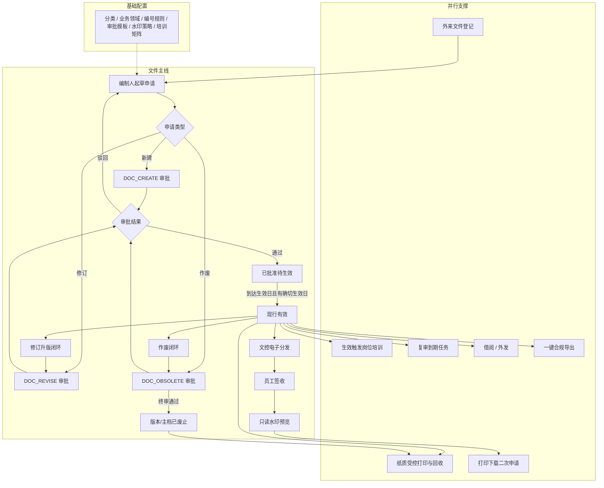

### 17.2 版本状态机

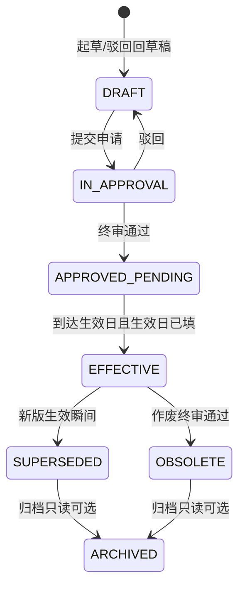

**硬规则摘要**：无确切生效日禁止进入现行；新版生效旧版自动「已替代」；同一主档同时最多一个现行版本。

### 17.3 内置审批通用引擎

适用于新建/修订/作废/借阅/外发/二次申请等业务单。

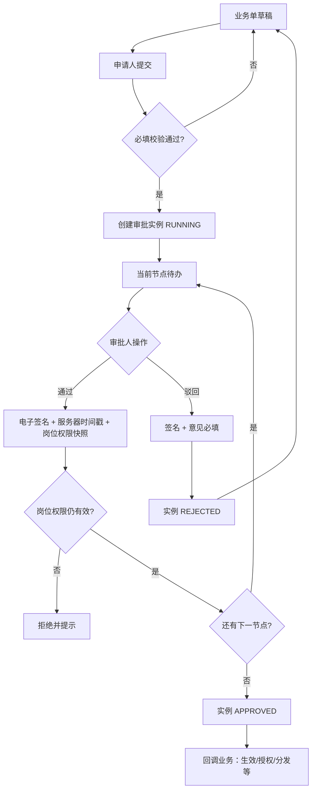

**首期默认节点（文件类）**

| 业务 | 节点顺序 |
|---|---|
| 新建 / 修订 / 作废 / 外发 | 1 部门审核 → 2 文控审核（终审） |
| 借阅 / 打印下载二次申请 | 1 部门审核 → 2 文控备案 |
| 纸质加印（可选） | 1 文控确认 |

### 17.4 新建文件流程

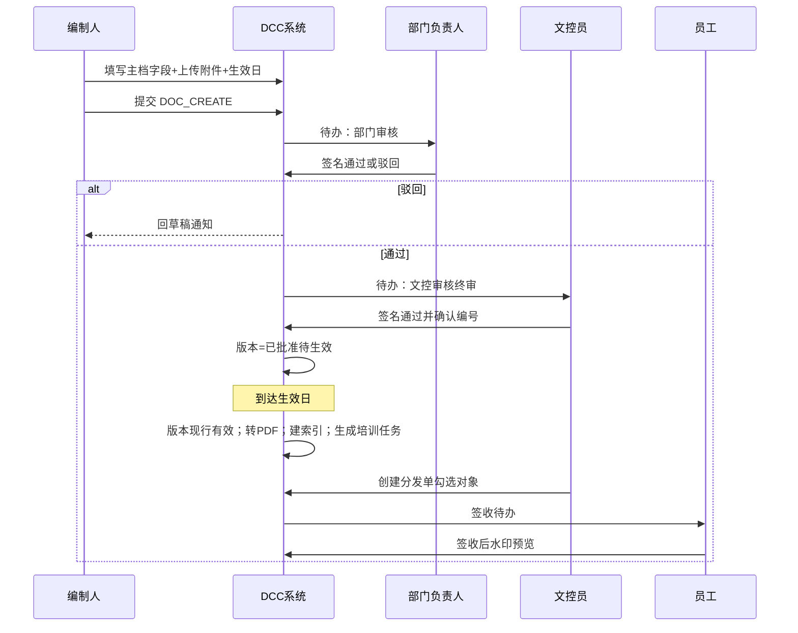

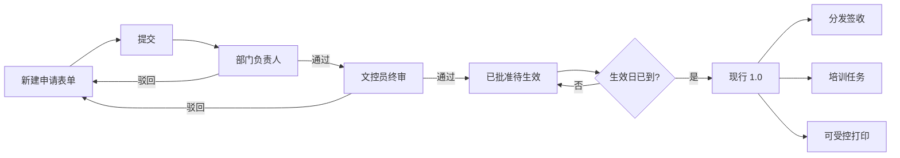

### 17.5 修订升版与变更闭环

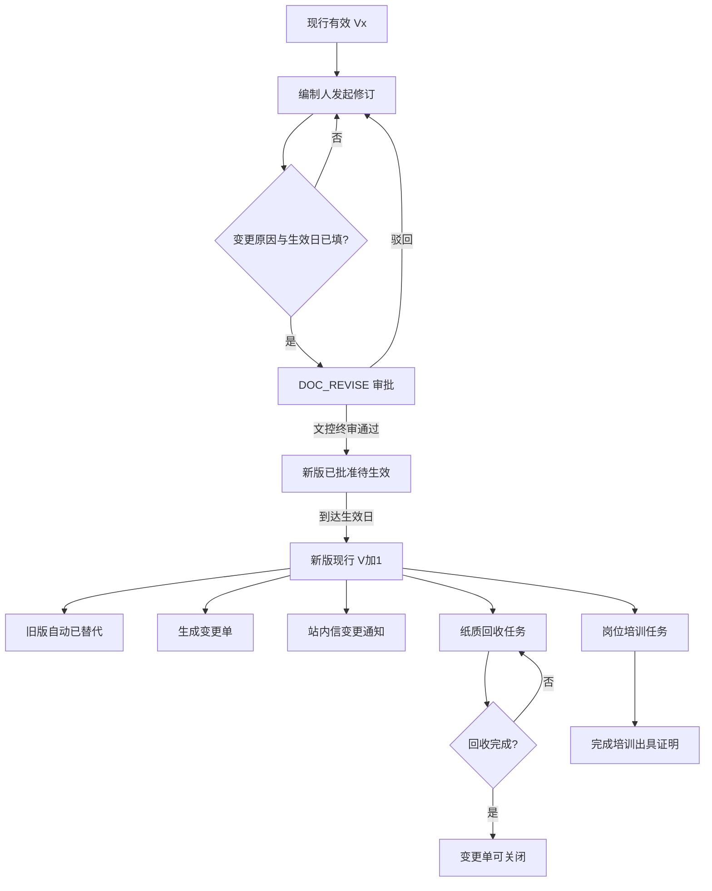

### 17.6 作废流程

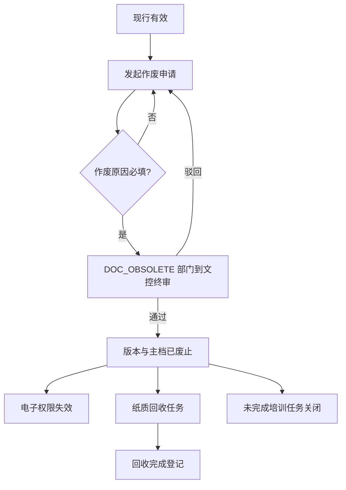

### 17.7 电子分发与签收

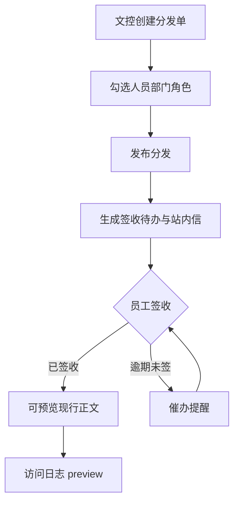

### 17.8 受控打印与纸质回收

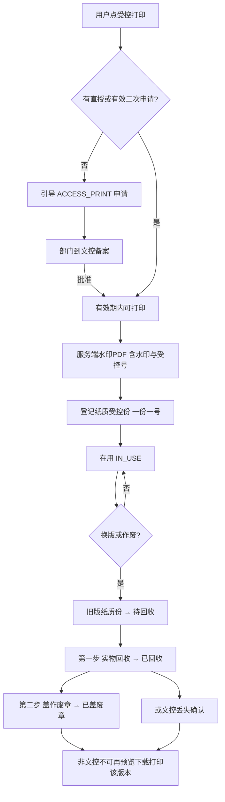

### 17.9 打印 / 下载二次申请

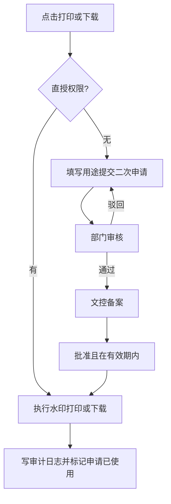

### 17.10 借阅流程

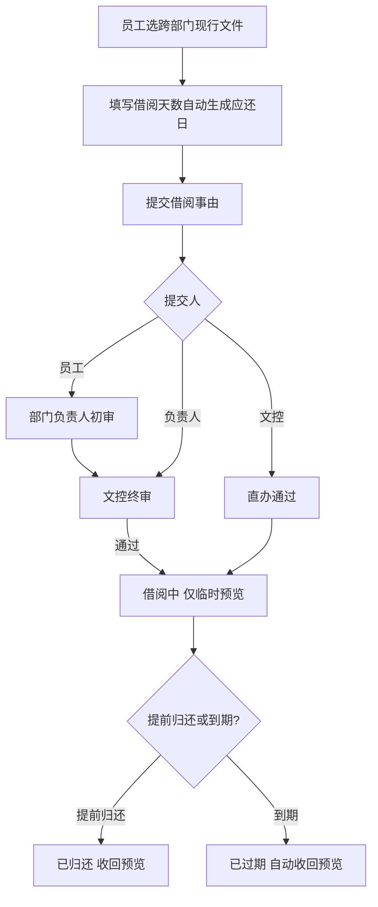

### 17.11 外发流程

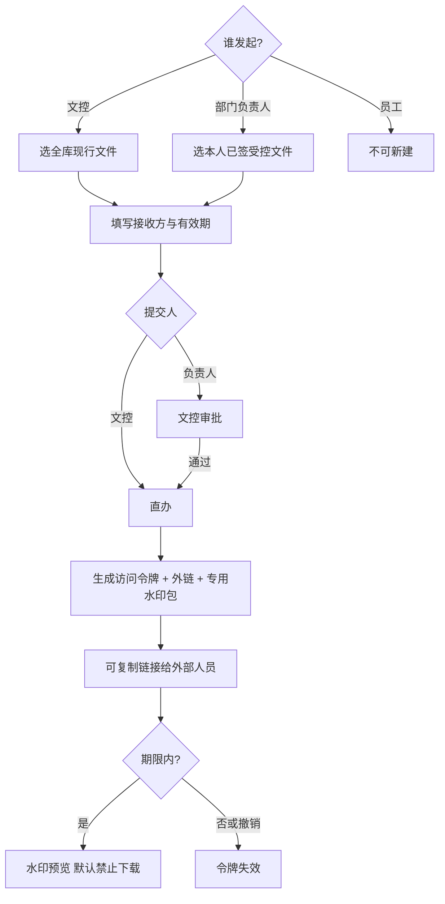

### 17.12 外来文件登记

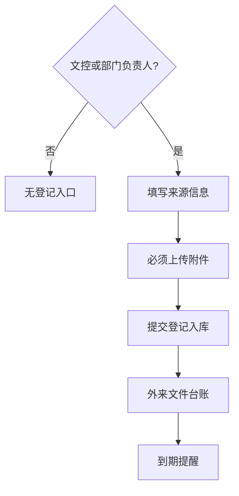

### 17.13 复审管理

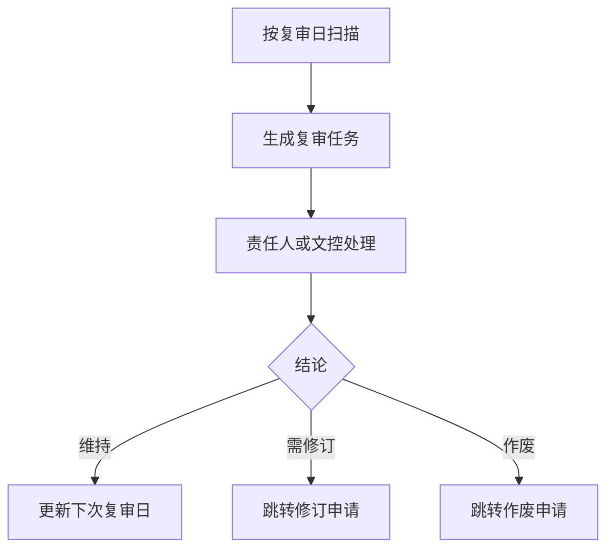

### 17.14 生效联动培训

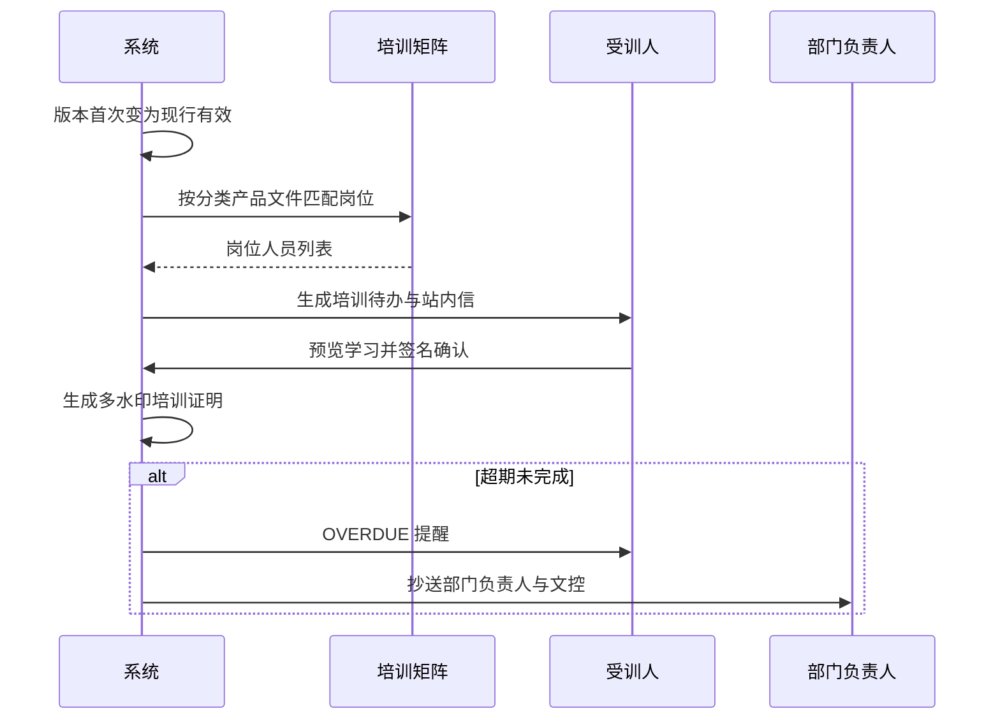

### 17.15 一键合规导出

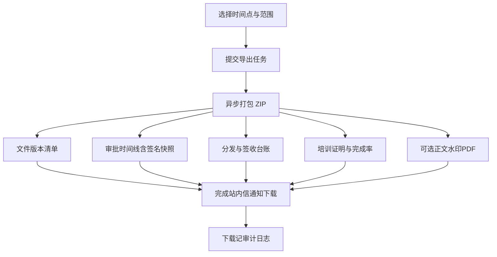

### 17.16 访问控制与数据域（横切）

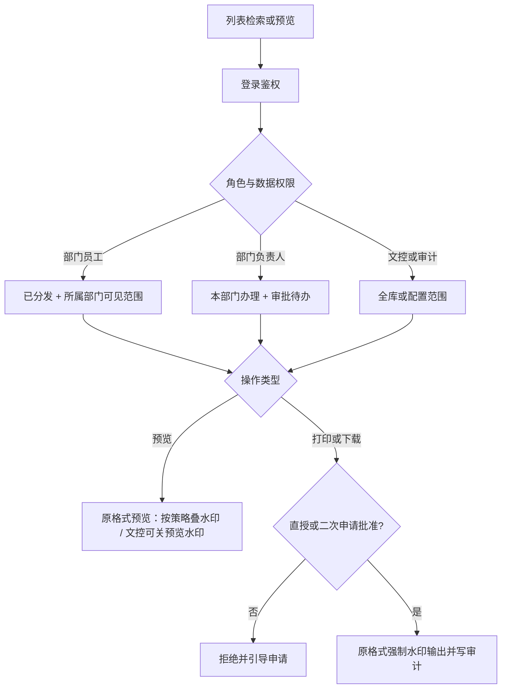

### 17.17 菜单能力与流程映射

| 菜单分组 | 主要入口 | 对应流程章节 |
|---|---|---|
| 总览 | DCC 工作台 | 待办聚合：审批/签收/培训/回收/二次申请 |
| 文件库 | 受控文件台账 | 17.1 / 17.4 / 17.8 / 17.16 |
| 申请与审批 | 申请（新建/修订/作废+我的申请）、待我审批 | 17.3～17.6 |
| 变更管理 | 变更单、变更通知 | 17.5 |
| 分发与签收 | 分发单、纸质受控 | 17.7 / 17.8 |
| 借阅与外发 | 借阅、外发、二次申请 | 17.9～17.11 |
| 培训任务 | 我的培训、岗位矩阵 | 17.14 |
| 外来与复审 | 外来登记、复审任务（≠ 待我审批） | 17.12 / 17.13 |
| 台账查询 | 综合查询、记录 | 17.15 / 17.16（只读检索） |
| 基础配置 | 单页内选分类/领域/部门/编号/审批/水印 | 支撑全部流程 |

### 17.18 主路径验收对照（与 §14）

| # | 验收主路径 | 流程图 |
|---|---|---|
| 1 | 新建→审批→生效→分发→签收→水印预览 | 17.4 + 17.7 |
| 2 | 修订（原因+生效日）→升版→旧版失效→通知→回收→培训→关单 | 17.5 + 17.14 |
| 3 | 作废→权限失效→纸质回收 | 17.6 |
| 4 | 打印/下载二次申请留痕 | 17.9 |
| 5 | 外来登记；借阅/外发 | 17.10～17.12 |
| 6 | 合规时间点打包导出 | 17.15 |
| 7 | 生产/研发数据域隔离；机密「密」标 | 17.16 + §1.5 |


---


---

## 18. 数据表清单与表间关联（V1.4）

> 本章汇总首期需建的 `dcc_*` 表及其关联，供库表设计 / ORM / 接口联调使用。  
> **约定**：① 业务表主键均为 `id`（bigint）；② 若现网多租户，所有表带 `tenant_id`；③ 用户 / 部门 / 角色 / 附件 `file_id` **不建 DCC 侧外键**，逻辑关联现网组织与文件服务；④ 审批对业务单采用 **`biz_type` + `biz_id` 多态关联**（非硬 FK）。

### 18.1 表清单（按域分组）

| 域 | 表名 | 说明 |
|---|---|---|
| 配置 | `dcc_category` | 文件分类（树，`parent_id`） |
| 配置 | `dcc_product_type` | **业务领域**字典（界面名；字段仍 `product_type_id`） |
| 配置 | `dcc_number_rule` | 编号规则 |
| 配置 | `dcc_watermark_policy` | 水印策略 |
| 配置 | `dcc_notify_rule` | 提醒规则 |
| 配置 | `dcc_training_matrix` | 岗位-文件培训矩阵 |
| 配置 | `dcc_approval_template` | 审批流程模板 |
| 配置 | `dcc_approval_template_node` | 模板节点 |
| 核心 | `dcc_document` | 文件主档 |
| 核心 | `dcc_document_version` | 文件正式版本（审批升版，如 1.0/2.0） |
| 核心 | `dcc_form_revision` | 三级表单轻量修订（免审批 r1/r2…，见 §8.2.4a） |
| 申请 | `dcc_apply` | 新建/修订/作废申请 |
| 审批 | `dcc_approval_instance` | 审批实例 |
| 审批 | `dcc_approval_task` | 审批任务（含签名快照） |
| 审批 | `dcc_approval_log` | 审批动作日志 |
| 变更 | `dcc_change_order` | 变更单 |
| 变更 | `dcc_change_notice` | 变更通知 |
| 变更 | `dcc_change_notice_user` | 通知接收人 |
| 分发 | `dcc_distribution` | 分发单 |
| 分发 | `dcc_distribution_target` | 分发对象 |
| 分发 | `dcc_receipt` | 签收记录 |
| 纸质 | `dcc_hard_copy` | 纸质受控份 |
| 纸质 | `dcc_hard_copy_recycle_task` | 纸质回收任务 |
| 借阅外发 | `dcc_borrow` | 借阅单 |
| 借阅外发 | `dcc_external_release` | 外发单 |
| 外来复审 | `dcc_external_doc` | 外来文件 |
| 外来复审 | `dcc_review_task` | 复审任务 |
| 培训 | `dcc_training_task` | 培训任务 |
| 权限审计 | `dcc_access_apply` | 打印/下载二次申请 |
| 权限审计 | `dcc_access_log` | 预览/下载/打印日志 |
| 合规 | `dcc_compliance_export` | 一键合规导出任务 |

**合计**：约 **30** 张业务表（不含现网用户/部门/角色/文件元数据表）。

### 18.2 总览 ER 图（核心关联）

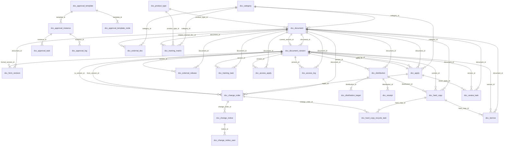

### 18.3 中心枢纽：主档 ↔ 版本 ↔ 申请

| 关联 | 基数 | 外键 / 字段 | 说明 |
|---|---|---|---|
| category → document | 1:N | `dcc_document.category_id` | 主档必属分类 |
| product_type ↔ document | M:N | 关联表或逗号分隔编码 | **多业务领域**；筛选命中任一 |
| owner_dept ↔ document | M:N | 关联表或逗号分隔 | **多所属部门**；直授命中任一 |
| document.file_level | 属性 | `dcc_document.file_level` | 必填枚举 L1/L2/L3；与业务领域正交 |
| document → version | 1:N | `dcc_document_version.document_id` | 一主档多版本 |
| document → 现行版本 | 1:0..1 | `dcc_document.current_version_id` → `dcc_document_version.id` | **指针**；同时最多一个 EFFECTIVE |
| apply → category / level / product | N:1 | `category_id` / `file_level` / `product_type_id` | 起草时选定级别；业务领域可选 |
| apply → document / version | N:0..1 | `document_id` / `version_id` | 新建发布后回写；修订/作废指向既有主档 |
| version → apply | N:0..1 | `dcc_document_version.apply_id` | 本版来源申请单 |
| apply 自关联文件 | N:N（弱） | `dcc_apply.related_doc_ids` | 逗号分隔 ID，**非关系表**；二期可拆关联表 |

**业务闭环**：申请终审通过 → 生成/更新 `dcc_document` + `dcc_document_version` → 回写 `apply.document_id/version_id` → 生效后 `document.current_version_id` 指向新版，旧版 `SUPERSEDED`。

### 18.4 审批域关联（含多态）

| 关联 | 基数 | 字段 | 说明 |
|---|---|---|---|
| template → node | 1:N | `dcc_approval_template_node.template_id` | 节点顺序 `node_order` |
| template → instance | 1:N | `dcc_approval_instance.template_id` | 运行时实例 |
| instance → task | 1:N | `dcc_approval_task.instance_id` | 每节点生成待办 |
| instance → log | 1:N | `dcc_approval_log.instance_id` | 动作审计 |
| **instance → 业务单** | N:1（多态） | `biz_type` + `biz_id` | **不设物理 FK**；按类型指向不同业务表 |

**`biz_type` → 业务表映射（首期）**

| biz_type | 指向表 | biz_id 含义 |
|---|---|---|
| CREATE / REVISE / OBSOLETE | `dcc_apply` | 申请单 id |
| BORROW | `dcc_borrow` | 借阅单 id |
| EXTERNAL | `dcc_external_release` | 外发单 id |
| HARDCOPY_PRINT | `dcc_hard_copy` 或申请扩展 | 加印业务 id（实现时可独立申请表或复用 apply） |
| ACCESS_PRINT / ACCESS_DOWNLOAD | `dcc_access_apply` | 二次申请 id |
| EXT_REGISTER（可选） | `dcc_external_doc` | 外来登记 id |

> 查询待办：`approval_task` → `instance` → 按 `biz_type` 联查对应业务单标题/编号。

### 18.5 变更 / 分发 / 签收 / 纸质

| 关联 | 基数 | 字段 | 说明 |
|---|---|---|---|
| change_order → document | N:1 | `document_id` | 所属主档 |
| change_order → from/to version | N:1 | `from_version_id` / `to_version_id` | 旧版→新版 |
| change_order → apply | N:0..1 | `apply_id` | 来源修订申请 |
| notice → change_order | N:1 | `change_order_id` | 一条变更可多通知 |
| notice_user → notice | N:1 | `notice_id` | 接收人明细 |
| distribution → document/version | N:1 | `document_id` / `version_id` | 分发某版本 |
| target → distribution | N:1 | `distribution_id` | 对象展开到用户 |
| receipt → distribution | N:1 | `distribution_id` | 每用户一条签收 |
| hard_copy → document/version | N:1 | `document_id` / `version_id` | 纸质绑定电子版 |
| hard_copy → distribution | N:0..1 | `distribution_id` | 可选关联电子分发 |
| recycle_task → hard_copy | N:1 | `hard_copy_id` | 待回收份 |
| recycle_task → change_order | N:0..1 | `change_order_id` | 换版回收来源 |
| recycle_task → apply | N:0..1 | `obsolete_apply_id` | 作废回收来源 |

**关闭约束**：`dcc_change_order` 状态→CLOSED 的前提 = 该文件相关 `dcc_hard_copy`（IN_USE）均已回收/作废章/丢失确认（见 §8.8）。

### 18.6 借阅 / 外发 / 外来 / 复审 / 培训 / 二次申请 / 日志 / 合规

| 关联 | 基数 | 字段 | 说明 |
|---|---|---|---|
| borrow → document/version | N:1 | `document_id` / `version_id` | 借阅对象 |
| borrow → hard_copy | N:0..1 | `hard_copy_id` | 纸质借阅必填 |
| external_release → document/version | N:1 | `document_id` / `version_id` | 外发对象 |
| external_doc → category | N:1 | `category_id` | 建议 EXT_* 分类 |
| external_doc → document | N:0..1 | `related_internal_doc_id` | 转化为内部受控后关联 |
| external_doc → self | N:0..1 | `replace_ext_id` | 被新外来文件替代 |
| review_task → document/version | N:1 | `document_id` / `version_id` | 复审对象 |
| review_task → apply | N:0..1 | `result_apply_id` | 结论修订/作废后挂申请 |
| training_matrix → category/product/document | N:0..1 | 三者择一优先 document | 匹配规则配置 |
| training_task → document/version | N:1 | `document_id` / `version_id` | 生效版本触发 |
| access_apply → document/version | N:1 | `document_id` / `version_id` | 二次申请对象 |
| access_log → document/version | N:1 | `document_id` / `version_id` | 访问留痕；`remark` 可记 copy_no |
| hard_copy → access_log | 逻辑 | 打印时写 log | 无强制 FK |
| compliance_export | 独立 | `scope_*` / `file_id` | 按时间点筛选多表打包，**不强制 FK 到单文件** |

### 18.7 配置表关联

| 表 | 被引用方 | 字段 | 说明 |
|---|---|---|---|
| `dcc_category` | document / apply / external_doc / training_matrix / number_rule（若按分类） | `category_id` | 树：`parent_id` 自关联 |
| `dcc_product_type` | document / apply / training_matrix | `product_type_id` | |
| `dcc_number_rule` | （服务） | 按分类/规则编码取号 | 运行时引用，可不落 FK |
| `dcc_watermark_policy` | （服务） | 全局/按密级策略 | 打印下载预览读取 |
| `dcc_notify_rule` | （服务） | 事件→提醒 | 不直接 FK 业务单 |
| `dcc_approval_template` | instance | `template_id` | 按 `biz_type` 选用模板 |

### 18.8 与现网系统的逻辑关联（非 DCC 表）

| DCC 字段（示例） | 现网对象 | 说明 |
|---|---|---|
| `*_user_id` / `applicant_id` / `assignee_id` / `holder_user_id` | 用户 | 逻辑关联，建议索引 |
| `owner_dept_id` / `holder_dept_id` | 部门 | 逻辑关联 |
| `file_id` / `pdf_file_id` / `draft_file_id` / `proof_file_id` / `package_file_id` | 文件服务对象 | 存文件中心 ID |
| 角色码（权限、审批人 ROLE） | 角色管理 | 不落 DCC 角色表 |
| 站内信待办 | 消息中心 | 推送引用业务单号 / 审批 task id |

### 18.9 建议物理外键与索引（实现指引）

**建议建物理 FK（同库内）**

- `document_version.document_id` → `document.id`
- `document.current_version_id` → `document_version.id`（可延迟约束或应用层保证，避免循环插入问题）
- `approval_template_node.template_id` → `approval_template.id`
- `approval_task.instance_id` / `approval_log.instance_id` → `approval_instance.id`
- `change_notice.change_order_id` → `change_order.id`
- `change_notice_user.notice_id` → `change_notice.id`
- `distribution_target.distribution_id` / `receipt.distribution_id` → `distribution.id`
- `hard_copy.document_id` / `version_id` → 主档/版本
- `recycle_task.hard_copy_id` → `hard_copy.id`
- 各业务表上的 `document_id` / `version_id`（apply、distribution、borrow、external_release、review_task、training_task、access_* 等）

**不建议物理 FK**

- `approval_instance.biz_id`（多态）
- 所有指向现网用户/部门/文件服务的 ID
- `apply.related_doc_ids`（字符串列表）

**高频索引建议**

- `document(doc_no)` 唯一；`(status, access_domain, category_id, file_level, product_type_id)`；单独索引 `file_level`、`product_type_id`
- `document_version(document_id, version_no)` 唯一；`(version_status, effective_date)`
- `apply(apply_no)`；`(status, applicant_id, apply_type)`
- `approval_task(assignee_id, status)`；`approval_instance(biz_type, biz_id)`
- `receipt(user_id, status)`；`training_task(assignee_id, status)`
- `access_log(document_id, created_at)`；`access_apply(applicant_id, status)`

### 18.10 主链路数据依赖（创建顺序）

开发初始化 / 联调造数建议按以下依赖顺序：

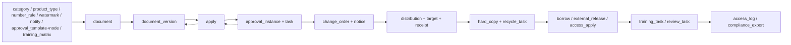

1. 配置表  
2. 主档 + 版本（或先申请再发布生成）  
3. 申请 + 审批实例/任务  
4. 变更单/通知、分发/签收  
5. 纸质份与回收  
6. 借阅/外发/二次申请  
7. 培训/复审  
8. 访问日志与合规导出  


---


---

## 19. 文件级别三级与所属部门（V1.5 增补）

> 本章固化 2026-07-22 新增业务规则；与原型工作台流程指南一致。其余能力仍按 V1.2～V1.4。

### 19.1 文件级别（三级）

| 级别 | 编码 | 含义 | 网页改正文 | 内容变更是否审批 |
|---|---|---|---|---|
| 一级 | L1 | 宏观文件（公司级/宏观制度） | **不可** | **须**走修订/新建/作废审批 |
| 二级 | L2 | 部门细则（具体细节部门文件） | **不可** | **须**走修订/新建/作废审批 |
| 三级 | L3 | 表单 | **可直接编辑保存**（Word/Excel/PPT 轻量改正文；PDF 叠字段） | **免审批**；每次保存递增轻量修订号 `rN` 并留痕（**不**推进正式 `1.0/2.0`，见 §4.2.2）；新建入库与作废 **仍须审批**；需要正式受控升版时走修订审批 |

**字段（V1.5.8 / T-01 会议定稿）**：主档与申请单使用独立字段 **`file_level`**（`L1`/`L2`/`L3`）。**禁止**再用 `product_type_id` / `dcc_product_type` 兼代表文件级别。

### 19.1a 业务领域（与文件级别正交 · 多选）

| 项 | 约定 |
|---|---|
| 字段 | 主档/申请：**多值**关联 `dcc_product_type`（关联表或逗号分隔编码，见 §8.2.3） |
| 语义 | **业务领域 / 业务线**（检测方向或量产业务），用于台账筛选、培训矩阵过滤、数据域白名单等 |
| 多选 | 一份文件可挂 **多个**业务领域；筛选时命中任一即可 |
| 展示 | 中文名用**英文逗号**拼接，无空格或统一 `,`（例：`半导体检测,前沿检测`） |
| 与级别关系 | 任意业务领域组合均可挂 L1/L2/L3 |
| 必填 | 至少选择 1 个 |
| 预置示例 | 半导体检测、前沿检测、硅光芯片量产（及可选「通用」）；见 §8.19.1 |
| 界面文案 | 统一显示「业务领域」 |

### 19.2 文件所属部门（多选）

| 项 | 说明 |
|---|---|
| 字段 | 主档/申请：**多值**所属部门（关联表或逗号分隔；见 §8.2.3） |
| 首期字典 | **行政部**（文控归口）、**市场部、技术部、IT部、财务部**（可扩展） |
| 多选 | 一份文件可归属 **多个**部门；列表展示英文逗号分隔部门名 |
| 菜单 | 基础配置 →「文件所属部门」；申请时多选，至少 1 个 |
| 编制部门 | 可另存申请人编制部门；与「所属部门」多值列表独立 |

### 19.3 下载 / 打印直授规则（增量）

| 场景 | 规则 |
|---|---|
| 用户部门命中文件**任一**所属部门，且密级 **非机密** | **一 / 二 / 三级规则相同**：**可直接下载/受控打印**，无需二次申请（仍强制水印 + 审计日志） |
| 机密（SECRET） | **不可**本部门直授；须走打印/下载二次申请（或文控直授权限） |
| 用户部门不在所属部门列表中 | 仍按原规则：直授权限或二次申请；若分类/文件标记禁止下载，跨部门仍不可下 |
| 文控/管理员已授 `dcc:doc:download` / `print` | 保持原全局能力 |

### 19.4 审批边界小结

| 动作 | 一级 | 二级 | 三级 |
|---|---|---|---|
| 新建入库 | 审批 | 审批 | 审批 |
| 网页改正文 | 不允许 | 不允许 | 允许；免审批；保存写轻量修订 `rN`（不改正式版号） |
| 正式修订升版 | 审批 | 审批 | 须走修订审批以推进 `1.0→2.0`；日常改内容用网页编辑即可 |
| 作废 | 审批 | 审批 | 审批 |
| 本部门非密下载打印 | 直授 | 直授 | 直授 |
| 机密下载打印 | 二次申请 | 二次申请 | 二次申请 |


### 19.5 基础配置增改权限（V1.5.1 / V1.5.15）

| 配置项 | 入口 | 文控 | 其他部门 |
|---|---|---|---|
| 文件分类 | 基础配置 → 文件分类 | 可新增 / 修改 | 只读 |
| 业务领域 | 基础配置 → 业务领域 | 可新增 / 修改 | 只读 |
| 文件所属部门 | 基础配置 → 文件所属部门 | 可新增 / 修改 | 只读 |
| 水印策略 | 基础配置 → 水印策略 | 可改模板/透明度/**预览开关**/保存 | 只读（可点阶段预览看效果） |

- 角色判定：`DCC_CONTROLLER` / `DCC_ADMIN`；非文控按钮禁用并提示「仅文控可改」。
- 分类字段：编码（唯一、大写规范）、名称、默认复审月、默认可下载、备注；保存后立即可用于申请/台账。

### 19.6 对接已确认项（V1.5.2，部分条目 V1.5.6 修订）

| 项 | 结论 |
|---|---|
| 编号样式 | 维持 MG-{CAT}-{YYYY}-{SEQ:4} 示意（如 MG-SOP-2026-0001） |
| 发布后分发 | **文控手动勾选**，不自动分发全部门 |
| 外来文件登记 | **需要审批**后入库 |
| 三级表单保存 | **免审批**；每次保存递增轻量修订号 `rN` 并留痕；**不**自动推进正式主版本（V1.5.6 / T-02-A） |
| 复审 / 签收强制 / 外发有效期 / 所属部门扩展 | 首期暂不细化（「先不管」） |
| 文件分类覆盖 | 各部门都会用到分类，清单后续由各部门补 |
| 演示角色 | **文控员属行政部**；IT 部为独立 **IT工程师**（非运维、非文控）；另有市场/技术/财务部员工（本部门直下/直打） |
| 新建/修订表单 | 菜单进入时**不预填**演示数据；仅从台账详情「发起修订/作废」时带入对应文件 |

### 19.7 阶段水印、角色视图与申请入口（V1.5.3 / V1.5.15）

#### 19.7.1 阶段状态水印

见 §7.3「阶段状态水印」表。实现要点：

1. **保留**原有 `姓名+工号+文件编号+时间` 平铺水印（当预览水印开启时）。  
2. **新增**红色阶段标记层；机密额外正中斜对角「机密文件」。  
3. **预览**：受全局 `apply_preview` 控制（文控可关）；关闭时预览不叠水印。  
4. **下载件 / 受控打印件**：始终强制水印（含阶段层）；借阅/外发输出同。

#### 19.7.2 角色工作台与「我的受控文件」（V1.5.17）

1. 顶栏切换演示角色后：工作台统计、待办、近 7 日生效、「我的受控文件」、培训待办、打印下载申请及可见性收口列表同步切换。  
2. **受控文件台账**全员可查（待生效仅文控）；「我的受控文件」= 分发给当前角色且**已签收**的份，操作权限见 §5.3。  
3. 部门员工近 7 日生效等按所属部门收窄；文控/负责人看更大范围。  
4. 变更单/变更通知/分发单/记录等过滤规则见 §8.1 角色差异表。

#### 19.7.3 申请表单入口

| 入口 | 行为 |
|---|---|
| 新建借阅 | 选跨部门现行文件；填借阅天数自动生成应还日；部门→文控审批 |
| 新建外发 | 仅文控/负责人；负责人限已签收文件；通过后令牌+外链+水印包 |
| 外来文件登记 | 仅文控/负责人；**必须上传附件** |
| 新建/修订申请 | **必须真实上传正文附件**；空表进入；从详情发起修订/作废可预填 |
| 新建打印申请 / 新建下载申请 | 打开二次申请弹窗，**可选择文件** |

### 19.8 前端工程与嵌入现网（V1.5.4～V1.5.5）

#### 19.8.1 当前可点测交付物

| 路径 | 说明 |
|---|---|
| `web/` | **Vite + Vue 3.5 + TypeScript 5.3 + Element Plus + Vue Router**；Mock 数据；`npm run dev` 点测（默认 `http://127.0.0.1:5173/dcc/dashboard`） |
| `web/src/router/modules/dcc.js` | **DCC 路由模块**（默认导出 `dccRouter`，另导出 `dccChildren`）；公司主路由 / 若依直接 import 合并即可 |
| `web/src/views/dcc/` | 页面按侧栏分组（英文目录）：`overview` / `library` / `approval` / `change` / `distribution` / `borrow` / `training` / `external` / `report` / `config` |
| `web/src/composables/dccApp.js` | 业务逻辑与演示动作（provide/inject 给各页面）；无真实后端 |
| `web/src/utils/office.js` | Word/Excel/PPT 前端预览与三级轻量编辑写回 |
| `web/src/utils/officeWatermark.js` | 下载用水印（原格式嵌入：docx/xlsx/pptx/图片） |
| `web/src/mock/data.js` | Mock 台账与业务列表 |
| 根目录 `index.html` + `assets/` | 旧 CDN 静态原型，仅作备份；日常以 `web/` 为准 |

> 原型阶段仍不接后端；审批/登记等操作刷新后还原。正式开发以本章与 §2 技术约定为准，**不以静态 CDN 页作为交付形态**。

#### 19.8.2 `web/` 目录约定（V1.5.5）

```text
web/src/
├── main.ts                      # 注册 router + Element Plus
├── App.vue                      # 仅壳：侧栏/顶栏/页签 + <router-view>（嵌入现网后删除本壳）
├── router/
│   ├── index.js                 # 本仓库独立运行入口
│   └── modules/dcc.js           # ★ 导出给公司主路由 / 若依
├── views/dcc/
│   ├── overview/                # 总览
│   ├── library/                 # 文件库
│   ├── approval/                # 申请与审批
│   ├── change/                  # 变更管理
│   ├── distribution/            # 分发与签收
│   ├── borrow/                  # 借阅与外发
│   ├── training/                # 培训任务
│   ├── external/                # 外来与复审
│   ├── report/                  # 台账查询
│   ├── config/                  # 基础配置
│   ├── index.js                 # 视图汇总（供路由引用）
│   ├── useDccPage.js            # inject('dcc')
│   └── DccOverlays.vue          # 全局抽屉/弹窗
├── composables/dccApp.js
├── mock/data.js
└── styles/layout.css
```

路由约定：业务 path 统一前缀 `/dcc/*`；`meta.dccKey` 与侧栏菜单 key 对齐；`meta.title` 供面包屑/页签。

#### 19.8.3 嵌入现网 / 若依时必须调整

1. **去掉原型壳**：自研侧栏、顶栏「演示角色切换」、页脚「原型」标识；改用现网/若依 Layout + 登录用户 + 菜单/按钮权限。  
2. **前端落地**：将 `router/modules/dcc.js` 的 `dccRouter`（或 `dccChildren`）并入公司主路由；页面目录整体迁入现网工程 `views/dcc`（可按需改为懒加载 `() => import(...)`）；样式与表格/筛选/分页规范对齐现网。  
3. **后端落地**：`dcc-server`（或同构模块）使用 **JDK 17 + Spring Boot 3.4 + MyBatis Plus**；表前缀 `dcc_`；Redis 按需；复用网关鉴权、组织用户、文件中心、站内信。  
4. **禁止**将原型内「顶栏切角色」作为生产权限方案；生产权限一律走现网角色与数据权限。

#### 19.8.4 迁移策略（建议）

```text
阶段 1（当前）  web/ Mock 点测；路由已模块化，对齐需求与 UI
阶段 2          将 modules/dcc.js + views/dcc 挂入现网/若依主工程，接真实登录/菜单（可仍 Mock API）
阶段 3          上 dcc 后端 + MySQL；替换 Mock；跑通 §14 验收主路径
阶段 4          培训/合规导出/纸质回收等其余模块按优先级补齐
```

### 19.9 需求评审处置结论（V1.5.6～V1.5.8）

> 依据《DCC文控系统-需求更新.md》评审意见；本节为开发与建表前的权威结论摘要。

| 编号 | 优先级 | 结论 | 落地章节 |
|---|---|---|---|
| **T-01** | P0 | **已关闭（会议定稿）**：拆双字段——`file_level`（L1/L2/L3）+ `product_type_id`（业务领域）；字典预置半导体检测 / 前沿检测 / 硅光芯片量产等。 | §1.5、§8.2.3、§8.19.1、§19.1、§19.1a |
| **T-02** | P0 | **已采纳方案 A**：三级表单轻量修订 `rN` 与正式 `1.0/2.0` 分离。 | §4.2.2、§8.2.4a、§19.1 |
| **T-03** | P0 | **已采纳方案 B**：as_of 以审计/事件回放；缺口则导出失败。 | §8.18.5 |
| **T-04** | P1 | **已关闭**：定位改为「震慑 + 溯源」；删除「防住/拦截绕过」类验收承诺。 | §1.2、§1.3、§5.4、§8.8.3、§8.17、§10、§14 |
| **T-05** | P1 | **已关闭**：记录不接 BPM 理由、首期能力边界、二期演进与可替换审批抽象层。 | §6.5、§7.1、§13.2 |
| **T-06** | P1 | **已关闭**：生效日按服务器时区日历日判定；扫描周期/失败重试/幂等/补偿已写明。 | §4.5.1、§10.1 C2 |
| **T-07** | P1 | **已关闭**：岗位数据完整性为前置条件；空解析告警；调岗不影响历史证明。 | §8.16.5 |
| **T-08** | P1 | **已关闭**：补充冷启动/迁移、版本起点、纸质存量、双轨切换标准。 | §13.3 |
| **T-09** | P2 | **已关闭**：密级首期仅 INTERNAL/SECRET；PUBLIC 仅预留。 | §1.5、§8.2.3 |
| **T-10** | P2 | **已关闭**：明确 `ALL`=跨域共用文件；业务文件用 PROD/RD。 | §1.5、§8.2.3 |
| **T-11** | P2 | **已关闭**：§10 定为全局强制规则权威章节，他处引用。 | §10 |
| **T-12** | P2 | **已关闭**：审计日志默认保留 ≥ **6 年**（可配，且不低于质量体系确认值；上线前书面确认）。 | §10、§12 |
| **T-13** | P2 | **已关闭**：分发授予预览权，签收授予持续查看权。 | §4.5、§8.7 |
| **T-14** | P2 | **已关闭**：外链令牌哈希存储、可撤销、访问审计；强化项列二期。 | §8.10.1 |
| **T-15** | P2 | **已关闭**：检索 P95 小于 2s 为硬性验收；「10 秒定位」为体验目标。 | §1.2、§8.2.2、§12、§14、C6 |

**建表前检查清单**

1. ~~T-01~~ 已定稿：`dcc_document` / `dcc_apply` 同时具备 `file_level` + `product_type_id`。  
2. 已建 `dcc_form_revision`（或等价）且正式版号不被免审批保存改写。  
3. 已列出 as_of 回放所需事件清单，并在接口层强制写审计。  
4. 审批端口抽象已预留（§6.5），业务不耦合引擎内部。  
5. 审计保留年限已与质量体系确认并写入配置默认值。  
6. `dcc_product_type` 仅承载业务领域，种子数据含半导体检测等预置项。

---

**下一步**：按 **V1.5.19** 固化表结构与权限（含原格式预览/下载水印、三级 Office 轻量编辑、借阅/外发/外来/纸质两步回收、附件实装）；原型 `web/` 已对齐；后端按 T-03-B 事件模型 + §4.5.1 生效任务 + §13.3 迁移方案实施；**是否叠加服务端转 PDF** 见对接清单 IT 项。验收叠加 §14 + §17 + §18 + §19（含 §19.8～§19.9）。
